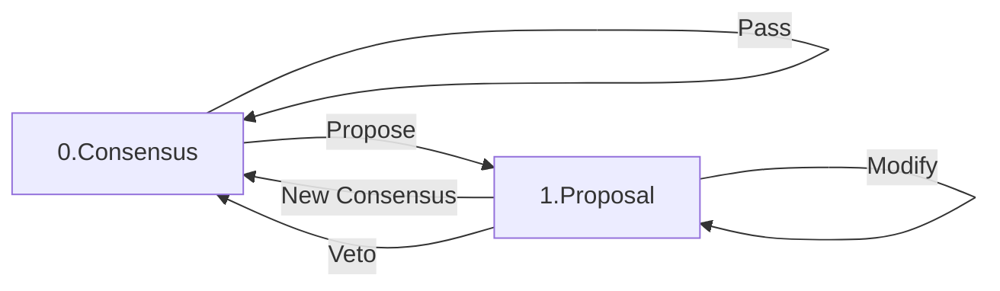

# Nitro contracts

## `NitroAdjudicator.sol`

## `ConsensusApp.sol`

The consensus application (or consensus game) is the unique application that runs in Nitro ledger channels. Its purpose is to allow ledger channel participants to safely update how the funds in the ledger channel are distributed, by way of unanimous consensus. Recall that a ledger channel can allocate to other channels as well as the participants themselves.

The consensus application is compatible with Nitro protocol, and therefore specifies some `AppAttributes` to be included in each commitment as well as a `validTransition` function which helps the nitro-adjudicator to settle disputes.

The application specific data are organised thus:

```solidity
    enum UpdateType { Consensus, Proposal }

    struct AppAttributes {
        uint32 numVotes;
        uint256[] proposedAllocation;
        address[] proposedDestination;
        UpdateType updateType;
    }
```

and are in addition to (in fact a branch of) the core commitment data:

```solidity
    struct CommitmentStruct {
        address channelType;
        uint32 nonce;
        address[] participants;
        uint8 commitmentType;
        uint32 turnNum;
        uint32 numVotes;
        address[] destination;
        uint256[] allocation;
        bytes appAttributes;
    }
```

Valid transitions conform to the following diagram:



Note that this state machine is transitioned cyclicly by n players.

### 2 player example scenarios

New Consensus

- `A1. PreFS; allocation: [5,5]; destination: [0xa,0xb]; proposedAllocation: [5,5]; proposedDestination: [0xa,0xb]; voteNum: 0`
- `B2. PreFS; allocation: [5,5]; destination: [0xa,0xb]; proposedAllocation: [5,5]; proposedDestination: [0xa,0xb]; voteNum: 0`
- `A3. PostFS; allocation: [5,5]; destination: [0xa,0xb]; proposedAllocation: [5,5]; proposedDestination: [0xa,0xb]; voteNum: 0`
- `B4. PostFS; allocation: [5,5]; destination: [0xa,0xb]; proposedAllocation: [5,5]; proposedDestination: [0xa,0xb]; voteNum: 0`
- `A5. App/Proposal; allocation: [5,5]; destination: [0xa,0xb]; proposedAllocation: [10]; proposedDestination: [0xChannel]; voteNum: 1`
- `A6. App/Consensus; allocation: [10]; destination: [0xChannel]; proposedAllocation: [10]; proposedDestination: [0xChannel]; voteNum: 0`

Veto

- `A1. PreFS; allocation: [5,5]; destination: [0xa,0xb]; proposedAllocation: [5,5]; proposedDestination: [0xa,0xb]; voteNum: 0`
- `B2. PreFS; allocation: [5,5]; destination: [0xa,0xb]; proposedAllocation: [5,5]; proposedDestination: [0xa,0xb]; voteNum: 0`
- `A3. PostFS; allocation: [5,5]; destination: [0xa,0xb]; proposedAllocation: [5,5]; proposedDestination: [0xa,0xb]; voteNum: 0`
- `B4. PostFS; allocation: [5,5]; destination: [0xa,0xb]; proposedAllocation: [5,5]; proposedDestination: [0xa,0xb]; voteNum: 0`
- `A5. App/Proposal; allocation: [5,5]; destination: [0xa,0xb]; proposedAllocation: [10]; proposedDestination: [0xChannel]; voteNum: 1`
- `A6. App/Consensus; allocation: [5,5]; destination: [0xa,0xb]; proposedAllocation: [5,5]; proposedDestination: [0xa,0xb]; voteNum: 0`

### 3 player example

New Consensus

- `A1. PreFS; allocation: [5,5,5]; destination: [0xa,0xb,0xc]; proposedAllocation: [5,5,5]; proposedDestination: [0xa,0xb,0xc]; voteNum: 0`
- `B2. PreFS; allocation: [5,5,5]; destination: [0xa,0xb,0xc]; proposedAllocation: [5,5,5]; proposedDestination: [0xa,0xb,0xc]; voteNum: 0`
- `C3. PreFS; allocation: [5,5,5]; destination: [0xa,0xb,0xc]; proposedAllocation: [5,5,5]; proposedDestination: [0xa,0xb,0xc]; voteNum: 0`
- `A4. PostFS; allocation: [5,5,5]; destination: [0xa,0xb,0xc]; proposedAllocation: [5,5,5]; proposedDestination: [0xa,0xb,0xc]; voteNum: 0`
- `B5. PostFS; allocation: [5,5,5]; destination: [0xa,0xb,0xc]; proposedAllocation: [5,5,5]; proposedDestination: [0xa,0xb,0xc]; voteNum: 0`
- `C6. PostFS; allocation: [5,5,5]; destination: [0xa,0xb,0xc]; proposedAllocation: [5,5,5]; proposedDestination: [0xa,0xb,0xc]; voteNum: 0`
- `A7. App/Proposal; allocation: [5,5,5]; destination: [0xa,0xb,0xc]; proposedAllocation: [15]; proposedDestination: [0xChannel]; voteNum: 1`
- `B8. App/Proposal; allocation: [5,5,5]; destination: [0xa,0xb,0xc]; proposedAllocation: [15]; proposedDestination: [0xChannel]; voteNum: 2`
- `C9. App/Consensus; allocation: [15]; destination: [0xChannel]; proposedAllocation: [15]; proposedDestination: [0xChannel]; voteNum: 3`
