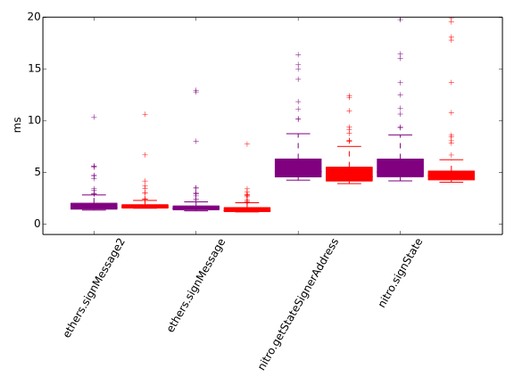
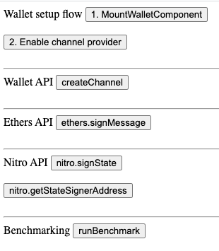

# Statechannels benchmarking

Ths package serves two purposes:

1. Benchmarking the ethers and nitro API for speed, in both a) node-js and b) browser settings:

2. A minimal testbed for the wallet API (including the @statechannels/iframe-channel-provider and @statechannels/channel-client packages), including benchmarking for speed if desired.

### Generating benchmarking plot

1. [Optional] Serve the wallet on localhost:3055
2. Run `yarn start`
3. Navigate to localhost:8080
4. [Optional] Trigger various tests by clicking the buttons:

5. Click the 'runBenchmark' button, and wait a few seconds
6. Copy paste the resulting `times-browser.json` file to _this directory_.
7. Run `yarn node-benchmark`
