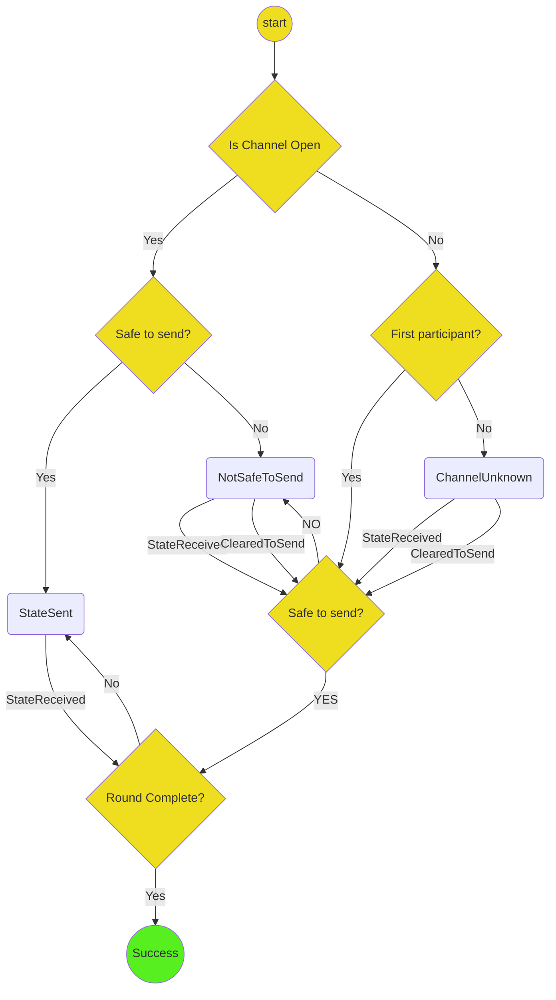

# Advancing the stage of a channel

The `AdvanceStage` protocol accepts two mandatory inputs and one optional input:

- `processId: String`
- `sharedData: Storage`
- `stateType: StateType`
- `args?`: the data needed to initialize the state. When the channel doesn't exist, this is the data needed to initialize the channel. When the channel does exist, it is just the channel id.

It returns success when the latest state on the channel is at least the state type given.

It can be used in any stage where the application attributes cannot change -- in other words, any stage other than the application stage.

When the channel does not exist, it writes a new channel to storage. When the channel does exist, it updates its latest states in storage in the following two cases:

1. When it is safe to send the next state
2. When the next stage has been reached.

It is safe to send the next state when a valid round of states is received, and it is not a complete round of states of the given `stateType`

A round of states is valid if either of the following conditions hold

- The first state is the latest stored state, each transition is valid, and there are `participants.length` state.
- The first state has `turnNum == 0`, each transition is valid, and it is now the participant's turn.

When it is safe to send the next state, the protocol

1. Crafts the next state
2. Stores the latest round of states in storage
3. Sends the latest round of states to the next participant in the channel

When a round of states is received or sent, and each state is of the target stage, the protocol

1. Stores the latest round of states in storage.
2. Forwards the latest round of states to the next participant, unless they are the last participant.
3. Returns success.

If the parameters passed to `initialize` are invalid, then it moves directly to `Failure`.
This can happen if, for example, the channel doesn't exist, but the `startingOpts` is undefined.
It can also happen if the `stateType` is incompatible with the latest state in storage.

## Decisions

- To simplify the communication assumptions in a channel with an arbitrary number of participants, each participant sends a valid round of states only to the next participant.

## Open questions

- What should cause the protocol to fail?

## State machine diagram

