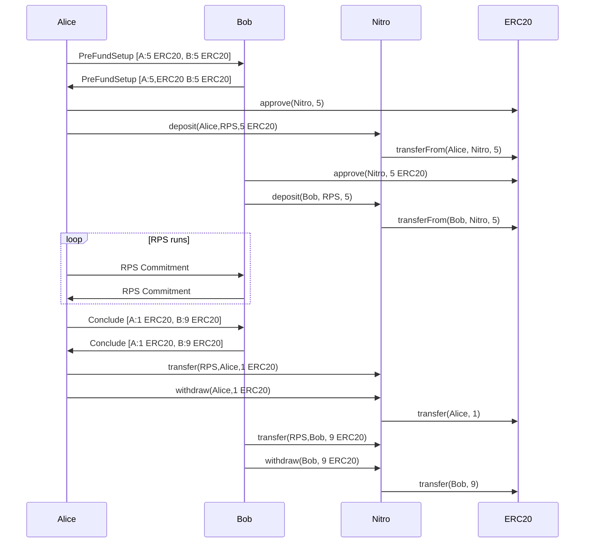

# ERC20s

```mermaid
sequenceDiagram
    participant Alice
    participant Bob
    participant Nitro
    participant ERC20
        Alice->>Bob: PreFundSetup [A:5 ERC20, B:5 ERC20]
        Bob->>Alice: PreFundSetup [A:5,ERC20 B:5 ERC20]
        Alice->>ERC20: approve(Nitro, 5)
        Alice->>Nitro: deposit(Alice,RPS,5 ERC20)
        Nitro->>ERC20: transferFrom(Alice, Nitro, 5)
        Bob->>ERC20: approve(Nitro, 5 ERC20)
        Bob->>Nitro: deposit(Bob, RPS, 5)
        Nitro->>ERC20: transferFrom(Bob, Nitro, 5)
    loop RPS runs
        Alice->>Bob: RPS Commitment
        Bob->>Alice: RPS Commitment
    end
        Alice->>Bob: Conclude [A:1 ERC20, B:9 ERC20]
        Bob->>Alice: Conclude [A:1 ERC20, B:9 ERC20]
        Alice->>Nitro: transfer(RPS,Alice,1 ERC20)
        Alice->>Nitro: withdraw(Alice,1 ERC20)
        Nitro->>ERC20: transfer(Alice, 1)
        Bob->>Nitro: transfer(RPS,Bob, 9 ERC20)
        Bob->>Nitro: withdraw(Bob, 9 ERC20)
        Nitro->>ERC20: transfer(Bob, 9)

```
