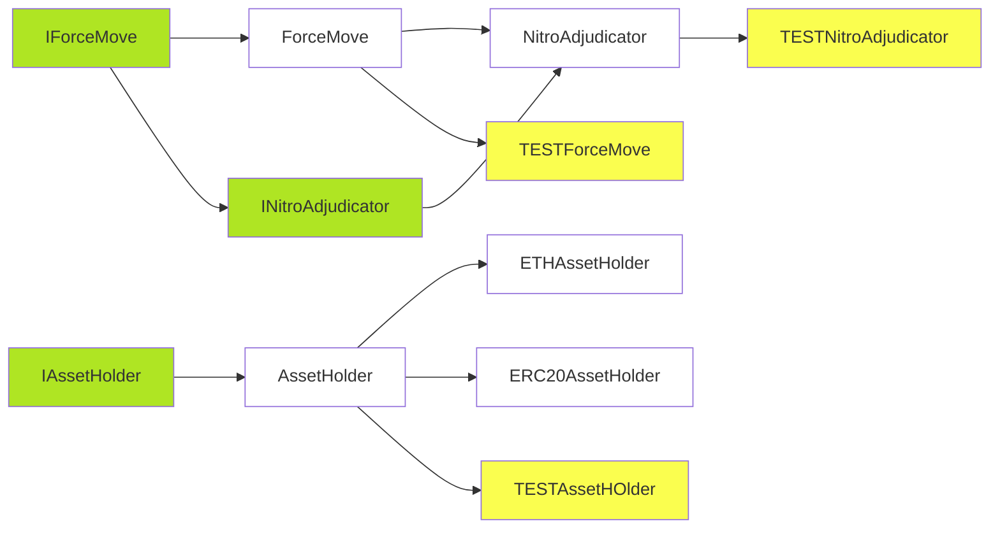
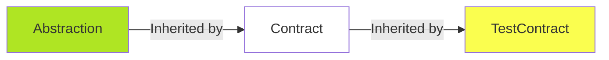

The following diagram shows how the contracts inherit from one another.

```mermaid
graph LR
linkStyle default interpolate basis
IForceMove--> ForceMove
IForceMove--> INitroAdjudicator
INitroAdjudicator--> NitroAdjudicator
ForceMove--> NitroAdjudicator
IAssetHolder--> AssetHolder
AssetHolder-->ETHAssetHolder
AssetHolder-->ERC20AssetHolder

ForceMove-->TESTForceMove
NitroAdjudicator--> TESTNitroAdjudicator

AssetHolder-->TESTAssetHOlder

classDef Contract fill:#ffffff;
classDef Abstract fill:#afe523;
classDef TestContract fill:#fafe4f;
class IForceMove,INitroAdjudicator,IAssetHolder Abstract;
class NitroAdjudicator,ForceMove,AssetHolder,ETHAssetHolder,ERC20AssetHolder Contract;
class TESTForceMove,TESTNitroAdjudicator,TESTAssetHOlder TestContract;
```

key:

```mermaid
graph LR
linkStyle default interpolate basis
Abstraction-->|Inherited by| Contract
Contract-->|Inherited by| TestContract
classDef Contract fill:#ffffff;
classDef Abstraction fill:#afe523;
classDef TestContract fill:#fafe4f;
class Abstraction Abstraction;
class Contract Contract;
class TestContract TestContract;

```
