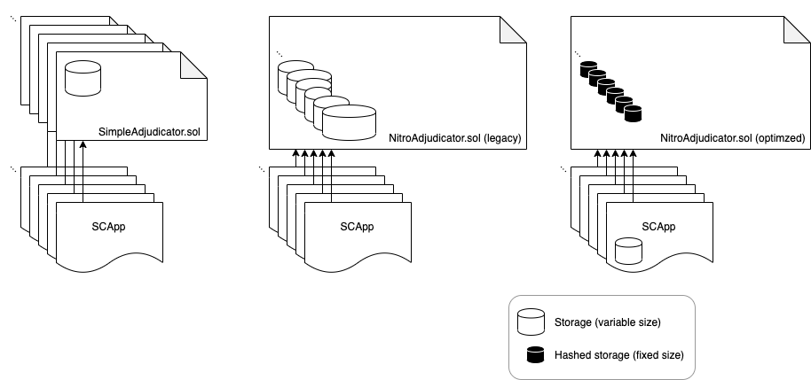

# State Channels gas consumption cut by 4x

As a part of a recent overhaul of the contract layer of the state channels stack, we have achieved a significant reduction in costs for users.

Gas is the unit of an internal currency used by the ethereum virtual machine (EVM) to meter the computational cost of processing a transaction. It must be paid for in ETH, at an exchange rate ("gas cost") set by the user (and tunable for speed / cost tradeoff). Right now a typical gas cost is around 2 GWei. See [here](https://ethgasstation.info/) for an up to date number. At recent exchange rates, this is about 0.30 USD for 1M gas. The fee for a transaction is the product of the gas cost with the amount of gas consumed: this fee is an incentive for ethereum miners to try and get the transaction included in the blockchain, since once it is 'confirmed' they are paid the fee.

Because the ethereum virtual machine is replicated on a large number ( > 7000 at the time of writing) of [ethereum nodes](https://www.ethernodes.org/), loosely speaking the transaction fees are symptomatic of having this large number of nodes compute and validate state transitions that may or may not be of interest to them. State channels exploit this fact to reduce the need for all of those state transitions to be validated, and therefore reduce the transaction fees that need to be paid. Since ethereum currently runs on a Proof of Work protocol, the use of state channels can also reduce the amount of unnecessary electricity consumed by the network as a whole.

State channels are a method of taking some blockchain transactions "off chain". A regular DApp would submit every state update as an ethereum transaction, incurring the gas costs and significant latency of at least one or more block confirmation periods (about 15 seconds) for each one. A state channel app (SCApp) ideally only submits two transactions, which bring about a state transition representing the _net_ change in state agreed upon by the state channel participants.

Consider a cellphone contract. The user pays 10USD to the cellphone provider, and for the following month enjoys 10USD credit to spend on calls and SMS messages. At the end of the month, the remaining credit (say 2USD) is either refunded to the user. Clearly the initial 10USD and the final 2USD are transactions that take place on the global financial network, in a manner that must be publicly verifiable by anyone else who wants to trust that those USDs retain their value and may be spent on something else. But the 0.01 USD paid for each SMS is typically _not_ of interest to the public, and is essentially an IOU signed by the participant and backed by their initial deposit. It is a private transaction transferring value in a private environment with only two participants: the rest of the world does not care about the 0.01 USD and does not consider it to have any true value. State channels operate in much the same way.

If starting from scratch, state channels require at least one transaction to set up, and one transaction to tear down, with all other state updates being off chain and therefore fast and free.
With our state channel network protocol [Nitro](https://magmo.com/nitro-protocol.pdf), however, users will likely only ever need to setup a single channel once with a hub administer it periodically (say once a month). A hub connection can be bootstrapped to _virtually_ setup and teardown state channels without any on chain transactions. This means that the setup and teardown costs of that single channel are less critical; although they are still a pain point and should be reduced if possible.

Additionally, settling state channel _disputes_ on chain will always involve ethereum transactions, even if in an ideal (and hopefully also in a typical) world they are never used. The _possibility_ of having disputes settled lends strong guarantees, however: the gas consumed during settlement therefore remains an important consideration. If the associated costs were prohibitive, or if they outweighed the assets staked in the channel, it might mean that challenges would never be used and the security guarantees would be effectively void.

Gas consumption in state channels is influenced by a number of factors: including the [EVM version](https://solidity.readthedocs.io/en/latest/using-the-compiler.html#target-options) (e.g. Constantinople vs Istanbul), and the solidity compiler (version and optimizer flags); but most of all it is influenced by the design of the smart contracts that implement the state channel adjudication and asset holding protocols: influenced, that is, by the efficiency by which those contracts compute the necessary state transitions. Efficiency in this context is determined by the [ethereum gas fee schedule](https://github.com/ethereum/yellowpaper).

Deploying the contracts to chain also consumes gas: typically a large amount since they involve storing an amount of bytecode roughly proportional to "size" of the contract source code.

Over the past 18 months, our contracts have been evolving towards a much more gas efficient implementation.

In the beginning, there was the _Simple Adjudicator_ contract, which adjudicated and held ETH for a single state channel. As such, a new deployed instance was required for each state channel. This is very inefficient from a gas point of view, since the same code is stored on chain over and over.

The Simple Adjudicator was replaced by the the first (legacy) incarnation of the _Nitro Adjudicator_, which stored sufficient data on chain for managing an unlimited number of channels. While this was a great improvement, since deployment costs were now only borne once and probably not by the end user, the other gas costs were still substantial; and equivalent to dozens of regular ethereum transactions (each costing a minimum if 21000 = 21K gas).

The major costs in the legacy contracts were incurred due to storing a relatively large amount of data for each channel: namely, the assets locked up for each directly funded channel, and the **outcome** for each finalized channel. Writing to and reading from storage incur 20K and 15K gas per 32 bytes (respectively), dwarfing other costs associated with computations that remain in memory.

> The main trick to reducing this was to reduce all storage to a minimum: a single `bytes32` storage slot. But how to do this, when the outcome data is application specific and surely longer than 32 bytes?

The answer lies in the magic of cryptographic hash functions, which are a core primitive of blockchains. Cryptographic has functions accept variable length input, are infeasible to invert, and produce fixed length output. By storing only the keccak256 **hash** of the outcome data, we ensure that only one slot gets used, regardless of the application. Previously it was several slots, and the number of slots would grow with the complexity of the application data.

Caption: "Minimizing on chain storage" 1. Originally, a new instance of the SimpleAdjudicator contract was needed for each state channel. 2. The legacy Nitro Adjudicator contract only needs to be deployed once and can support many state channels, albeit at a cost that depends on the complexity of the state channel. 3. The optimized Nitro Adjudicator contract stores the necessary data for each channel in a fixed-length hash, which reduces gas consumption considerably.

The only remaining puzzle is to get around the infeasibility of inverting the hash function to rehydrate the outcome data -- there is no point in storing the hashed data if the EVM is unable to properly interpret it and act accordingly (e.g. by slashing the deposit of a participant or paying out prize winnings). Remember that we are not using a hash for privacy reasons; that is just a side effect. The answer is for all the public methods (which are targeted via ethereum transactions) to accept the hydrated data as input. This input is then rehashed and checked against storage before any further execution is allowed: and the hydrated data supplied in the `CALLDATA` can be used in any necessary computations. So the effect is the same as having the hydrated data in storage, only with a lower cost.

The tradeoffs are some extra information in the `CALLDATA`, and the burden of tracking the data off-chain in your client. But this is very much in the spirit of Layer 2 and doing as much of the computation off chain as possible. Having every node of the ethereum main chain store all of this data is wasteful and costly: only interested parties need to store it.

It is important to remember that we are building the infrastructure for _generalized_ state channels -- meaning that SCApp developers can plug their own "rules" into our stack to rapidly develop their application without having to worry about funding and dispute resolution more than they need to. The gas costs will therefore remain dependent on the situation: how many states are needed to launch a challenge? How many participants are there in the channel? Does this transition confirm to the application specific rules? To get an idea of the overall savings, we concentrate on three main metrics. These are: (1) Deployment of the contract(s) (only needs to be done once, and most likely not by users); (2) Happy Path (depositing and then concluding and withdrawing funds) and (3) Challenge Path (raising a challenge and then responding to a challenge). Further, we tested these paths using an almost-trivial state channel application so that the situation-dependent costs are about as small as they could be -- meaning that the reported numbers are to be considered "best case" or lower bounds on typical gas consumption numbers. The figure reveals the savings that we have made:

As you can see, we have achieved a more than 4x improvement in the Happy Path and the Challenge Path that users may tread. As a bonus, the deployment costs are also significantly reduced due to some refactoring and tweaks performed in tandem with the optimization strategy.

Furthermore, we have also upgraded our contracts to allow for a channel to be backed by a combination of ETH and any number of ERC20 tokens. The opportunities that this opens up will be discussed in a future blog post.

For more information about how our contracts work, and to explore the source code, visit https://nitro-protocol.netlify.com/.
