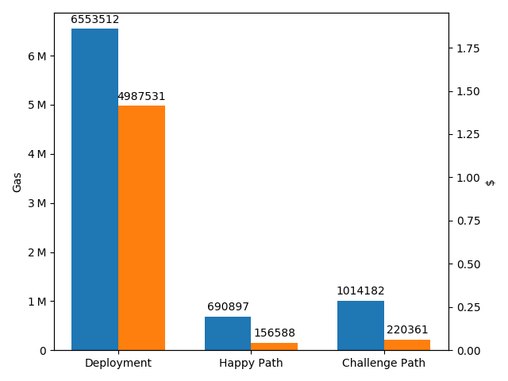

# State Channels gas consumption cut by 4x

As a part of a recent overhaul of the contract layer of the state channels stack, we have achieved a significant reduction in costs for users.

In the beginning, there was the Simple Adjudicator. This required a new deploy for each state channel. Then there was the first (legacy) incarnation of the Nitro Adjudicator, which stored sufficient data on chain for challenges and funding an unlimited\* number of channels.

While this was a great improvement, the gas costs were still substantial, and equivalent to dozens of regular ethereum transactions (each costing a minimum if 21000 = 21K gas).

Recall that gas is the unit of an internal currency used by the ethereum virtual machine to meter the computational cost of processing a transaction. It must be paid for in ETH, at an exchange rate ("gas cost") set by the user (and tunable for speed / cost tradeoff). Right now a typical gas cost is around 2 GWei. See [here](https://ethgasstation.info/) for an up to date number. At recent exchange rates, this is about 0.30 USD for 1M gas.

State channels are a method of taking transactions off chain. A regular Dapp would submit each state update as an ethereum transaction, incurring at least 21k _ gas cost). State channels do require at least one transaction to set up, and one transaction to tear down -- although with a state channel network protocol such as Nitro, users will likely only ever need to setup once with a hub and rebalance / administer periodically (say once a month). A hub connection can be bootstrapped to \_virtually_ setup and teardown state channels without any on chain transactions.

Nevertheless, there is inevitably some interaction with the chain, even if it is counterfactual (not actually used). An example of that is the challenge path, which in an ideal (and hopefully also in a typical) world are never used. The possibility of using the challenge path lends strong guarantees, however.

The major costs in the legacy contracts were incurred due to storing a relatively large amount of data for each channel: namely, the assets locked up for each directly funded channel, and the outcome for each finalized channel. Writing to and reading from storage incur 20K and 15K gas per 32 bytes (respectively), dwarfing other costs associated with computations that remain in memory.

The main trick to reducing this was to reduce all storage to the theoretical minimum: a single `bytes32` storage slot. But how to do this, when the outcome data is application specific and surely longer than 32 bytes?

The answer lies in the magic of cryptographic hash functions, which are a core primitive of blockchains. Cryptographic has functions accept variable length input, are infeasible to invert, and produce fixed length output. By storing only the keccak256 **hash** of the outcome data, we ensure that only one slot gets used, regardless of the application. Previously it was several slots, and the number of slots would grow with the complexity of the application data.

The only remaining puzzle is to get around the infeasibility of inverting the has function to rehydrate the outcome data -- there is no point in storing the data if the EVM is unable to properly interpret it and act accordingly (e.g. by slashing the deposit of a participant or paying out prize winnings). Remember that we are not using a hash for privacy reasons; that is just a side effect. The answer is for all the public methods to accept the hydrated data as input. This input is then rehashed and checked against storage before any further execution is allowed: and the hydrated data supplied in the CALLDATA can be used in any necessary computations. So the effect is the same as having the hydrated data in storage, only with a lower cost.

The tradeoffs are some extra information in the calldata, and the burden of tracking the data offchain in your client. But this is very much in the spirit of Layer 2 and doing as much of the computation off chain as possible. Having every node of the ethereum main chain store all of this data is wasteful and costly: only interested parties need to store it.

Future tweaks

- fold holdings information into the same storage slot

More info

- https://nitro-protocol.netlify.com/

