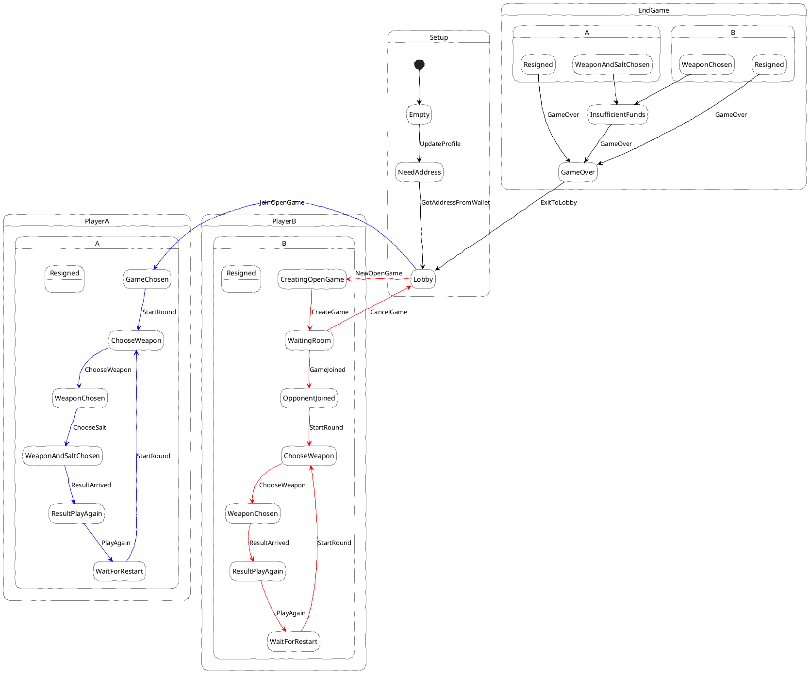

```plantuml
@startuml
skinparam state{
  BackgroundColor White
  BackgroundColor<<Warning>> Olive
  BorderColor Black
  FontName Helvetica
}
skinparam handwritten true
hide empty description
' Startgame
state Setup{
    [*] -[#black]-> Empty
    Empty -[#black]-> NeedAddress : UpdateProfile
    NeedAddress -[#black]-> Lobby : GotAddressFromWallet
}

' Player A
    state PlayerA {
    Lobby -[#blue]left-> A.GameChosen : JoinOpenGame
    A.GameChosen -[#blue]-> A.ChooseWeapon : StartRound
    A.ChooseWeapon -[#blue]-> A.WeaponChosen : ChooseWeapon
    A.WeaponChosen -[#blue]-> A.WeaponAndSaltChosen : ChooseSalt
    A.WeaponAndSaltChosen -[#blue]-> A.ResultPlayAgain : ResultArrived
    A.ResultPlayAgain -[#blue]-> A.WaitForRestart : PlayAgain
    A.WaitForRestart -[#blue]-> A.ChooseWeapon : StartRound
    A.Resigned :
    }

' Player B
' NOTE: ChooseWeaponB is actually just ChooseWeapon. Could refactor code to make it clearer though
    state PlayerB {
    Lobby -[#red]right-> B.CreatingOpenGame : NewOpenGame
    B.CreatingOpenGame -[#red]-> B.WaitingRoom : CreateGame
    B.WaitingRoom -[#red]-> Lobby: CancelGame
    B.WaitingRoom -[#red]-> B.OpponentJoined : GameJoined
    B.OpponentJoined -[#red]->B.ChooseWeapon : StartRound
    B.ChooseWeapon -[#red]-> B.WeaponChosen : ChooseWeapon
    B.WeaponChosen -[#red]-> B.ResultPlayAgain : ResultArrived
    B.ResultPlayAgain -[#red]-> B.WaitForRestart: PlayAgain
    B.WaitForRestart -[#red]-> B.ChooseWeapon : StartRound
    B.Resigned :
    }

' Endgame
state EndGame {
    B.WeaponChosen -[#black]-> InsufficientFunds
    A.WeaponAndSaltChosen -[#black]-> InsufficientFunds
    InsufficientFunds -[#black]-> GameOver : GameOver
    GameOver -[#black]-> Lobby : ExitToLobby
    A.Resigned -[#black]-> GameOver : GameOver
    B.Resigned -[#black]-> GameOver : GameOver
}

' Map States to Views
'    Empty: <Profile />
'    NeedAddress: <Lobby />
'    Lobby: <Lobby />
'    CreatingOpenGame: <Lobby />
'    WaitingRoom: <WaitingRoom />
'    GameChosen: <ProposeGame />
'    OpponentJoined: <OpponentJoined />
'    ChooseWeapon: <ChooseWeapon />

' style arrows to differentiate UI action from sage-put action ?
@enduml
```
