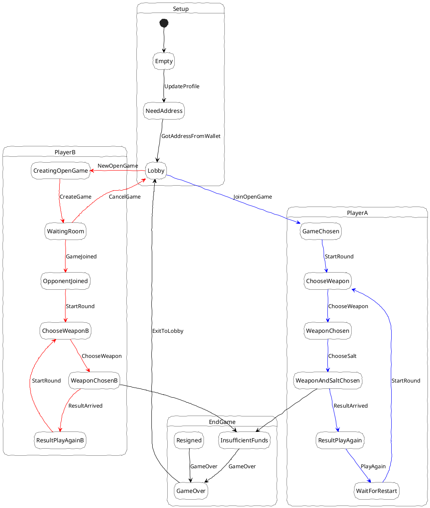

```plantuml
@startuml
skinparam state{
  BackgroundColor White
  BackgroundColor<<Warning>> Olive
  BorderColor Black
  FontName Helvetica
}
skinparam handwritten true
hide empty description
' Startgame
state Setup{
    [*] -[#black]-> Empty
    Empty -[#black]-> NeedAddress : UpdateProfile
    NeedAddress -[#black]-> Lobby : GotAddressFromWallet
}

' Player A
    state PlayerA {
    Lobby -[#blue]-> GameChosen : JoinOpenGame
    GameChosen -[#blue]-> ChooseWeapon : StartRound
    ChooseWeapon -[#blue]-> WeaponChosen : ChooseWeapon
    WeaponChosen -[#blue]-> WeaponAndSaltChosen : ChooseSalt
    WeaponAndSaltChosen -[#blue]-> ResultPlayAgain : ResultArrived
    ResultPlayAgain -[#blue]-> WaitForRestart : PlayAgain
    WaitForRestart -[#blue]-> ChooseWeapon : StartRound
    }

' Player B
' NOTE: ChooseWeaponB is actually just ChooseWeapon. Could refactor code to make it clearer though
    state PlayerB {
    Lobby -[#red]-> CreatingOpenGame : NewOpenGame
    CreatingOpenGame -[#red]-> WaitingRoom : CreateGame
    WaitingRoom -[#red]-> Lobby: CancelGame
    WaitingRoom -[#red]-> OpponentJoined : GameJoined
    OpponentJoined -[#red]->ChooseWeaponB : StartRound
    ChooseWeaponB -[#red]-> WeaponChosenB : ChooseWeapon
    WeaponChosenB -[#red]-> ResultPlayAgainB : ResultArrived
    ResultPlayAgainB -[#red]-> ChooseWeaponB : StartRound
    }

' Endgame
state EndGame {
    WeaponChosenB -[#black]-> InsufficientFunds
    WeaponAndSaltChosen -[#black]-> InsufficientFunds
    InsufficientFunds -[#black]-> GameOver : GameOver
    GameOver -[#black]-> Lobby : ExitToLobby
    Resigned -[#black]-> GameOver : GameOver
}

' Map States to Views
'    Empty: <Profile />
'    NeedAddress: <Lobby />
'    Lobby: <Lobby />
'    CreatingOpenGame: <Lobby />
'    WaitingRoom: <WaitingRoom />
'    GameChosen: <ProposeGame />
'    OpponentJoined: <OpponentJoined />
'    ChooseWeapon: <ChooseWeapon />
@enduml
```
