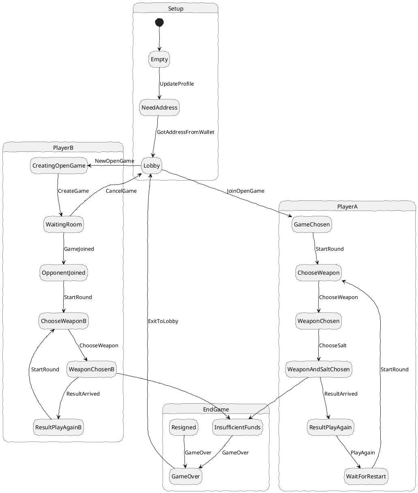

```plantuml
@startuml
skinparam monochrome true
skinparam handwritten true
hide empty description
' Startgame
state Setup{
    [*] --> Empty
    Empty --> NeedAddress : UpdateProfile
    NeedAddress --> Lobby : GotAddressFromWallet
}

' Player A
    state PlayerA {
    Lobby --> GameChosen : JoinOpenGame
    GameChosen --> ChooseWeapon : StartRound
    ChooseWeapon --> WeaponChosen : ChooseWeapon
    WeaponChosen --> WeaponAndSaltChosen : ChooseSalt
    WeaponAndSaltChosen --> ResultPlayAgain : ResultArrived
    ResultPlayAgain --> WaitForRestart : PlayAgain
    WaitForRestart --> ChooseWeapon : StartRound
    }

' Player B
' NOTE: ChooseWeaponB is actually just ChooseWeapon. Could refactor code to make it clearer though
    state PlayerB {
    Lobby --> CreatingOpenGame : NewOpenGame
    CreatingOpenGame --> WaitingRoom : CreateGame
    WaitingRoom --> Lobby: CancelGame
    WaitingRoom --> OpponentJoined : GameJoined
    OpponentJoined -->ChooseWeaponB : StartRound
    ChooseWeaponB --> WeaponChosenB : ChooseWeapon
    WeaponChosenB --> ResultPlayAgainB : ResultArrived
    ResultPlayAgainB --> ChooseWeaponB : StartRound
    }

' Endgame
state EndGame {
    WeaponChosenB --> InsufficientFunds
    WeaponAndSaltChosen --> InsufficientFunds
    InsufficientFunds --> GameOver : GameOver
    GameOver --> Lobby : ExitToLobby
    Resigned --> GameOver : GameOver
}

' Map States to Views
'    Empty: <Profile />
'    NeedAddress: <Lobby />
'    Lobby: <Lobby />
'    CreatingOpenGame: <Lobby />
'    WaitingRoom: <WaitingRoom />
'    GameChosen: <ProposeGame />
'    OpponentJoined: <OpponentJoined />
'    ChooseWeapon: <ChooseWeapon />
@enduml
```
