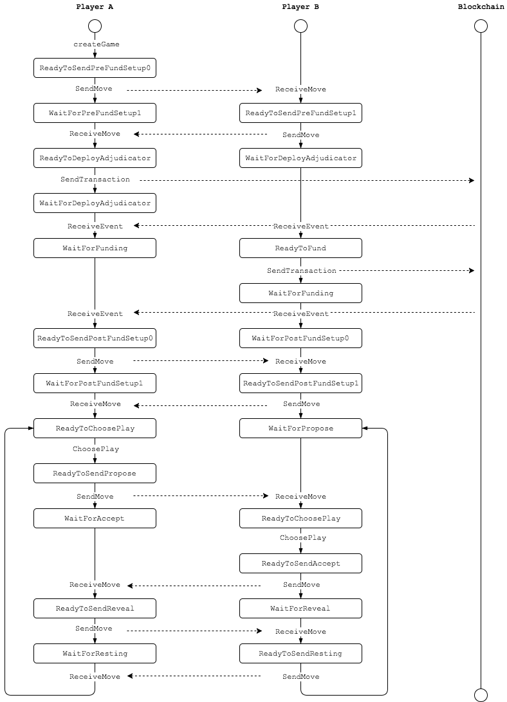

# Design Overview

## Application states

## The Game Engine

The Game Engine is responsible for storing the current state of the game and providing that information to the application controller.

The Application Controller is responsible for taking the next steps according to the state provided by the Game Engine and reporting back with the results. This could involve communicating with the opponent and/or the blockchain and/or rendering UI to get input from the user.

