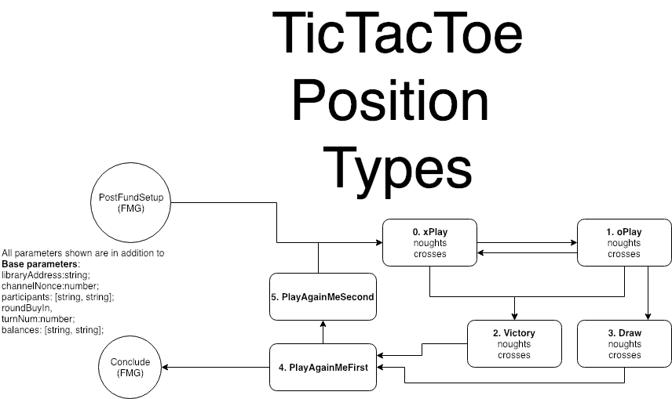

# Channel logic for RPS and TTT
With these resources in hand, the first step is to think about the core logic of Tic Tac Toe; the rules of the game that an adjudicator (i.e. a smart contract deployed to a blochchain) must reference when settling disputes, and that the players must adhere to in order to prevent disputes arising. In ForceMove, to specify the rules of the channel we need only provide a single, pure `validTransition` function returning a boolean from a pair of arguments, each representing the state of the channel. In terms of authoring smart contracts, everything else is taken care of by the our [minimal-viable ForceMove contracts](https://github.com/magmo/force-move-games).

### RPS logic
RPS is a 2 player game based on a simultanous reveal of both player's choice of weapon; the winner is determined by a fixed cyclic ordering of the three weapons. 

...-> Rock -> Scissors -> Paper -...

The game requires some slight modifications to be run asynchronously and trustlessely. Instead of a simultaneous reveal, the first player commits to a move by broadcasting an encrypted version of it to the second. The second player must then be incentivized to choose a weapon, before the first broadcasts their unencrypted choice along with proof that it matches the encrypted version that was committed to in the earlier step. 

Both RPS and TTT are multi-round games; players 'stake' a certain portion of their channel balance on a round, and can continue to play multiple rounds until one player runs out of funds. For simplicity, we specify this stake to be 20% of each player's starting balance, which in turn for simplicity is the same for both players. Note that these choices are *not restrictions of the ForceMove protocol*, but merely simplifications made in our applications, tentatively tying us to a special case for the purpose of demonstration. 

The *gamestate* of RPS is composed of 7 concatenated 32-byte variables, stored in the last 224 elements of a byte array that represents the full state of the channel. 

    // RockPaperScissors State Fields
    // (relative to gamestate offset)
    // ==============================
    // [  0 -  31] enum positionType
    // [ 32 -  63] uint256 stake
    // [ 64 -  95] bytes32 preCommit
    // [ 96 - 127] enum bPlay
    // [128 - 159] enum aPlay
    // [160 - 191] bytes32 salt
    // [192 - 223] uint256 roundNum

The first variable has an `enum` type, and can take values from the set  `{ Start, RoundProposed, RoundAccepted, Reveal, Concluded }`. The use of an `enum` (essentially a custom type) is a pattern that we will use throughout the app to constrain ourselves and protect against runtime errors -- both in solidity code and in TypeScript. 

 > TODO: `Concluded` almost certainly *does not belong* in the `positionType`, since the latter is a subset of the `gameState`. In RPS, in accordance with the ForceMove protocol, when a conclude state is constructed it does not have a `gameState` at all.

>   NB in the whitepaper, `Start` is called `Resting`, `RoundProposed` is called `ProposeRound`, and so on.

The second variable is the stake of of the game -- the amount transferred from the loser to the winner after a single round. `preCommit` is the salted hash of the first player's weapon. `bPlay` and `aPlay` are the second and first player's unencrypted weapon choices: again, in a custom type that can take variables from the set `{ Rock, Paper, Scissors }`. `salt` is the salt (used for increased security), and `roundNum` is a counter for the number of rounds that have been played. 

In the file `RockPaperScissorsState.sol`, a library with several helper functions is described. The functions essentially keep track of the position of each of the above variables in the full channel state, and allow other functions to access the variables in a convenient way. 

This library is imported in the file `RockPaperScissorsGame.sol`, where the `validTransition` function is defined. Broadly, the function switches the input state and output state by `positionType`, and executes an appropriate subfunction for each combination. Most of these subfunctions are straightforward, and are an expression of the allowed transitions, for example those shown in Figure 1 of the whitepaper:


**Fig1: Rock Paper Scissors Channel-State-Machine Diagram:** Each player may sign the position at the tip of an arrow emanating from any state signed by the previous player.

> The App-State-Machine diagram (introduced below) will wwork quite differently, and describes the transitions of a *single* player.

 Explicitly: 

    // The following transitions are allowed:
    //
    // Start -> RoundProposed
    // RoundProposed -> Start // reject game
    // RoundProposed -> RoundAccepted
    // RoundAccepted -> Reveal
    // Reveal -> Start
    // Start -> Concluded

In many of these transitions, we must simply ensure that the resolution of the channel (stored in the main channel state, not in the gamestate) does not change. When proposing a round, we must ensure the stake does not exceed the resolution of the proposing player. When accepting, we must ensure that the `preCommit` does not change, and so on. Upon revealing, we must ensure that the resolutions are updated in accordance with the rules of the game. 

The core rules of the game are enshrined in the `winnings` helper function:
```typescript
function winnings(RockPaperScissorsState.Play firstPlay, RockPaperScissorsState.Play secondPlay, uint256 stake)
private pure returns (uint256, uint256) {
    if (firstPlay == secondPlay) { // no-one won
        return (stake, stake);
    } else if ((firstPlay == RockPaperScissorsState.Play.Rock && secondPlay == RockPaperScissorsState.Play.Scissors) ||
                (firstPlay > secondPlay)) { // first player won
        return (2 * stake, 0);
    } else { // second player won
        return (0, 2 * stake);
    }
}
```
The ordering is enforced by the position of each of the possibilities in the definition of `enum Play`, which get transformed into the `number` type when compiled. One edge case must be handled manually ('going around the corner').

### TTT logic

TTT is natively a turn based game, so there is no need to have a commit/reveal stage. There is a 3x3 grid which is alternately marked with a cross "X" (by the first player) or a nought "O" (by the second player). Exactly one mark must be made, and it cannot be made in a location where a mark already exists. If either player successfully achieves three marks in a row, column or diagonal, they win the game. 

Once more, it is convenient to make some decisions to simplify the application. We chose to have Xs *always playing first* in any given round; to give the loser (or whomever was Os in the event of a draw) the sole right to play first in the next round. Note that Player A (who "proposes" the channel*), begins as Xs but the roles can swap thereafter.

>  *In our current lobby implementation, 'proposing' happens when you **join someone else's game**.

For the time being, states are encoded as hex strings. In future, it will be far more manageable to store them as structs; we are just waiting for some infrastructure to catch up before implementing that. 


    // TicTacToe State Fields
    // (relative to gamestate offset) 
    // ==============================
    // [  0 -  31] enum positionType
    // [ 32 -  63] uint256 stake
    // [ 64 -  95] uint16 noughts
    // [ 96 - 127] uint16 crosses


The gamestate of TTT is composed of 4 concatenated 32-byte variables, stored in the last 128 elements of the full state byte array. The `positionType` now takes values in `{ XPlaying, OPlaying, Victory, Draw, PlayAgainMeFirst, PlayAgainMeSecond }`. Note some differences in the `gameState`, compared to that of RPS. Here proposal and acceptance are separated from the game itself, and represented by `PlayAgainMeFirst` and `PlayAgainMeSecond` respectively. The two positions `Victory` and `Draw` are introduced because the final moves of the game are different to preceding moves (in RPS, the first player plays the first move simultaneous with their proposition, and the second player makes a move as their acceptance -- there are no more moves). I have not included a roundNum nor a salt variable, since these are not necessary.

> Many of these decisions were arrived at iteratively -- in other words, after a process of trial and error. It is also useful to realise that there are many possibilities for choosing which information is stored in the position type, versus in other fields. Likewise, the encoding of the board itself (see below) can be achieved in many ways. Choosing the 'right' way will often be a matter of taste and/or convenience.  

 The custom typed `aPlay` and `bPlay` have become `noughts` and `crosses`: integers representing the locations of the marks of each player. The encoding is as follows: 

    // Unravelling of grid is as follows:
    // 
    //      0  |  1  |  2  
    //   +-----------------+
    //      3  |  4  |  5  
    //   +-----------------+
    //      6  |  7  |  8  
    // 
    // The representation for a single mark is 2**(8-index). 
    // In binary notation: 
    //
    // e.g. noughts =   1 = 0b000000001
    //      crosses = 128 = 0b010000000
    // 
    // corresponds to 
    //
    //         |  X  |     
    //   +-----------------+
    //         |     |     
    //   +-----------------+
    //         |      |  0  
    // 
    //

`TicTacToeState.sol` and `TicTacToeGame.sol` work in much the same way as for RPS, except the rules of the game are now enshrined in the following helper functions:

```typescript
    uint16 constant topRow = 448; /*  0b111000000 = 448 mask for win @ row 1 */
    uint16 constant midRow =  56; /*  0b000111000 =  56 mask for win @ row 2 */
    uint16 constant botRow =   7; /*  0b000000111 =   7 mask for win @ row 3 */
    uint16 constant lefCol = 292; /*  0b100100100 = 292 mask for win @ col 1 */
    uint16 constant midCol = 146; /*  0b010010010 = 146 mask for win @ col 2 */
    uint16 constant rigCol =  73; /*  0b001001001 =  73 mask for win @ col 3 */
    uint16 constant dhDiag = 273; /*  0b100010001 = 273 mask for win @ downhill diag */
    uint16 constant uhDiag =  84; /*  0b001010100 =  84 mask for win @ uphill diag */
    //
    uint16 constant fullBd = 511; /*  0b111111111 = 511 full board */

    function hasWon(uint16 _marks) public pure returns (bool) {
        return (
            ((_marks & topRow) == topRow) ||
            ((_marks & midRow) == midRow) ||
            ((_marks & botRow) == botRow) ||
            ((_marks & lefCol) == lefCol) ||
            ((_marks & midCol) == midCol) ||
            ((_marks & rigCol) == rigCol) ||
            ((_marks & dhDiag) == dhDiag) ||
            ((_marks & uhDiag) == uhDiag) 
            );
    }

    function isDraw(uint16 _noughts, uint16 _crosses) public pure returns (bool) {
        if((_noughts ^ _crosses) == fullBd) { 
            return true; // using XOR. Note that a draw could include a winning position that is unnoticed / unclaimed
        }
    }

    function madeStrictlyOneMark(uint16 _new_marks, uint16 _old_marks) public pure returns (bool){
        uint16 i;
        bool already_marked = false;
        for (i = 0; i < 9; i++){
            if ((_new_marks >> i)%2 == 0 && (_old_marks >> i)%2 == 1){
                return false; // erased a mark
            } 
            else if ((_new_marks >> i)%2 == 1 && (_old_marks >> i)%2 == 0){
                if (already_marked == true){
                    return false; // made two or more marks
                }
                already_marked = true; // made at least one mark
            }
        }
        if (_new_marks == _old_marks) {return false;} // do not allow a non-move
        return true;
    }

    function areDisjoint(uint16 _noughts, uint16 _crosses) public pure returns (bool) {
        if((_noughts & _crosses) == 0){
            return true;
        }
    }

    function popCount(uint16 _marks) public pure returns (uint8) {
        uint16 i;
        uint8  count;
        for (i = 0; i < 9; i++){
            if ((_marks >> i)%2 == 1 ){
                count++; // erased a mark
            } 
        }
        return count;
    }
```

Various constants are introduced for readibility, and the `hasWon` function can check a putative `noughts` or `crosses` integer for a winning pattern. The formulae work by checking for equality between a masked input and the mask itself, where each mask represents a distinct winning pattern. Draws are defined as a full board, checked by looking at the disjunctive union of `noughts` and `crosses`. Disjointedness is self explanatory. `popCount` is a helper function, used later on to infer the marks type of the next move. Note that this is not to infer which player goes next (that is determined by the `turnNum` of the channel), but whether the next player should be playing a "0" or an "X". In this implementation of TTT, these roles can be played by either player, after the first round. 



## Economic incentives
In RPS, the `validTransition` function is such that an accepting player is permitted to sign a state assigning themselves the stake for that round. This disincentivizes the proposing player from quiting or stalling, which they might otherwise be tempted to do (for example, knowing that they have essentially lost the round, and that quitting might mean their stake was not lost). 

In TTT, each `Playing` state assigns the stake to the moving (i.e. signing) party. This prevents the other player from disconnecting when presented with a *surely-losing* board. For example, if the "0" player has the right to move from:

    //      X  |     |  0  
    //   +-----------------+
    //         |  0  |     
    //   +-----------------+
    //      X  |      |  X  

they may be tempted to quit instead, and the fair outcome is for the "X" player to then win the stake. 

> Of course, other states of the board are not so easy to 'price'. In more complicated games such as chess, it gets increasingly difficult to compute a fair price, or a fair penalty for unilaterally ending the game. We have adopted the simple maxim: "forfeit the stake if you quit an ongoing game".

These incentives should are encoded into the `validTransition` function. Some representative subfunctions are shown below: 
```typescript
    function validatePlayAgainMeFirstToPlayAgainMeSecond(bytes _old, bytes _new) private pure {
        require(_new.stake() == _old.stake());
        require(_new.aResolution() == _old.aResolution());
        require(_new.bResolution() == _old.bResolution());
    }
    
    function validatePlayAgainMeSecondToXPlaying(bytes _old, bytes _new) private pure {
        require(_new.noughts() == 0);
        require(TicTacToeHelpers.madeStrictlyOneMark(_new.crosses(),0)); // Xs moves first
        require(_new.stake() == _old.stake());
        if (State.indexOfMover(_new) == 0) { // mover is A
            require(_new.aResolution() == _old.aResolution() + _new.stake());
            require(_new.bResolution() == _old.bResolution() - _new.stake());
        } else if (State.indexOfMover(_new) == 1) { // mover is B
            require(_new.aResolution() == _old.aResolution() - _new.stake());
            require(_new.bResolution() == _old.bResolution() + _new.stake());
        }
    }

    function validateXPlayingToOPlaying(bytes _old, bytes _new) private pure {
        require(_new.stake() == _old.stake());
        require(TicTacToeHelpers.madeStrictlyOneMark(_new.noughts(), _old.noughts()));
        require((_new.crosses() == _old.crosses()));   
        if (State.indexOfMover(_new) == 0) { // mover is A
            require(_new.aResolution() == _old.aResolution() + 2 * _new.stake()); 
            require(_new.bResolution() == _old.bResolution() - 2 * _new.stake());
        } else if (State.indexOfMover(_new) == 1) { // mover is B
            require(_new.aResolution() == _old.aResolution() - 2 * _new.stake());
            require(_new.bResolution() == _old.bResolution() + 2 * _new.stake());
            // note factor of 2 to swing fully to other player
        } 
    }

        function validateVictoryToPlayAgainMeFirst(bytes _old, bytes _new) private pure {
        require(_new.aResolution() == _old.aResolution());
        require(_new.bResolution() == _old.bResolution());
    }

```

Note that moving into `XPlaying` from `PlayAgainMeSecond` is accompanied by assigning the stake to the moving player; during inconclusive play, the signing player takes twice the stake from the previous player, thereby assiging the stake to themselves; a penalty-free exit is possible from `PlayAgainMeFirst` or `PlayAgainMeSecond`, in the sense that the resolutions have not yet changed from the previous round.

Next, take a look at the document on [application logic](./app_logic.md).
