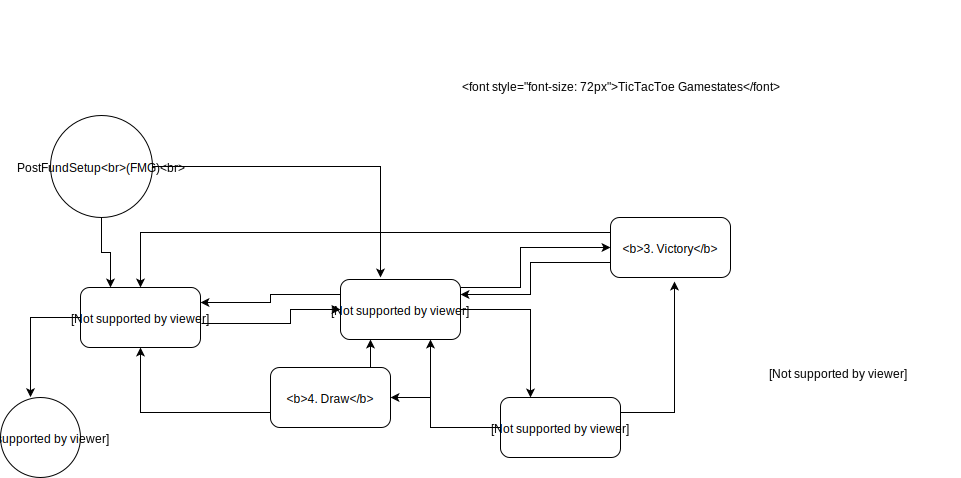

# Building Tic Tac Toe on ForceMove

The [ForceMove protocol](https://magmo.com/force-move-games.pdf) is designed to support general purpose, $n$-party state channel applications. It has a few restrictions, but is certainly general enough to allow for payments and many types of game. 

Rock Paper Scissors (henceforth RPS) was the first example of such a game, and is [live on the ropsten test net](https://demo.magmo.com). The code is [open source](https://github.com/magmo/rps-poc), and will be the starting point for developing a second game: Tic Tac Toe (henceforth TTT). 

We are going to work through the building of TTT, using ForceMove as a library and using RPS as an inspiration. The approach will be to build TTT mostly from 'the inside out', starting with the basic smart contract code and building up the overall state of the application piece-by-piece as we make certain design decisions. 

## Game logic
With these resources in hand, the first step is to think about the core logic of Tic Tac Toe; the rules of the game that an adjudicator (i.e. a smart contract deployed to a blochchain) must reference when settling disputes, and that the players must adhere to in order to prevent disputes arising. In ForceMove, to specify the rules of the channel we need only provide a single, pure `validTransition` function returning a boolean from a pair of arguments, each representing the state of the channel. 

### RPS logic
RPS is a 2 player game based on a simultanous reveal of both player's choice of weapon; the winner is determined by a fixed cyclic ordering of the three weapons. 

(RPS1) : ...-> Rock -> Scissors -> Paper -...

The game requires some slight modifications to be run asynchronously and trustlessely. Instead of a simultaneous reveal, the first player commits to a move by broadcasting an encrypted version of it to the second. The second player must then be incentivized to choose a weapon, before the first broadcasts their unencrypted choice along with proof that it matches the encrypted version that was committed to in the earlier step. 

The *gamestate* of RPS is composed of 7 concatenated 32-byte variables, stored in the last 224 elements of a byte array that represents the full state of the channel. 

    // RockPaperScissors State Fields
    // (relative to gamestate offset)
    // ==============================
    // [  0 -  31] enum positionType
    // [ 32 -  63] uint256 stake
    // [ 64 -  95] bytes32 preCommit
    // [ 96 - 127] enum bPlay
    // [128 - 159] enum aPlay
    // [160 - 191] bytes32 salt
    // [192 - 223] uint256 roundNum

The first variable has a custom type, and can take values from the set  `{ Start, RoundProposed, RoundAccepted, Reveal, Concluded }`. The use of an `enum` is a pattern that we will use throughout the app to constrain ourselves and protect against runtime errors -- both in solidity code and in TypeScript. 

The applications are written in [TypeScipt](https://www.typescriptlang.org) a) because it compiles to JavaScript and b) it is a typed language. The first property is important, since JavaScript code can run in the clients browser, and a state channel is designed to be almost exclusively a peer-to-peer protocol in the spirit of the decentralized web. The second property helps the application code follow the solidity code more closely, and provides all of the development benefits with almost no performance cost (with respect to JavaScript).

*   NB in the whitepaper, Start is called Resting?. Also, Concluded is a special state, not strictly part of the gamestate (since it must exist in any ForceMove game). So there is an argument for removing it, here. 

The second variable is the stake of of the game -- the amount transferred from the loser to the winner after a single round. `preCommit` is the salted hash of the first player's weapon. `bPlay` and `aPlay` are the second and first player's unencrypted weapon choices: again, in a custom type that can take variables from the set `{ Rock, Paper, Scissors }`. `salt` is the salt, and `roundNum` is a counter for the number of rounds that have been played. 

In the file `RockPaperScissorsState.sol`, a library with several helper functions is described. The functions essentially keep track of the position of each of the above variables in the full channel state, and allow other functions to access the variables in a convenient way. 

In the file `RockPaperScissorsGame.sol`, this library is imported, and the `validTransition` function is defined. Broadly, the function switches the input state and output state by `positionType`, and executes an appropriate subfunction for each combination. Most of these subfunctions are straightforward, and are an expression of the allowed transitions detailed in Figure 1 of the whitepaper. Explicitly: 

    // The following transitions are allowed:
    //
    // Start -> RoundProposed
    // RoundProposed -> Start // reject game
    // RoundProposed -> RoundAccepted
    // RoundAccepted -> Reveal
    // Reveal -> Start
    // Start -> Concluded
    //

In many of these transitions, we must simply ensure that the resolution of the channel (stored in the main channel state, not in the gamestate) does not change. When proposing a round, we must ensure the stake does not exceed the resolution of the proposing player. When accepting, we must ensure that the `preCommit` does not change, and so on. Upon revealing, we must ensure that the resolutions are updated in accordance with the rules of the game. 

The core rules of the game are enshrined in the `winnings` helper function:
```javascript
function winnings(RockPaperScissorsState.Play firstPlay, RockPaperScissorsState.Play secondPlay, uint256 stake)
private pure returns (uint256, uint256) {
    if (firstPlay == secondPlay) { // no-one won
        return (stake, stake);
    } else if ((firstPlay == RockPaperScissorsState.Play.Rock && secondPlay == RockPaperScissorsState.Play.Scissors) ||
                (firstPlay > secondPlay)) { // first player won
        return (2 * stake, 0);
    } else { // second player won
        return (0, 2 * stake);
    }
}
```
The ordering is enforced by the position of each of the possibilities in the definition of `enum Play`, which get transformed into the `number` type when compiled. One edge case must be handled manually ('going around the corner').

### TTT logic

TTT is natively a turn based game, and there is no need to have a commit/reveal stage. There is a 3x3 grid which is alternately marked with a cross "X" (by the first player) or a nought "O" (by the second player). Exactly one mark must be made, and it cannot be made in a location where a mark already exists. If either player successfully achieves three marks in a row, column or diagonal, they win the game. 

For the time being, states are encoded as hex strings. In future, it will be far more manageable to store them as structs; we are just waiting for some infrastructure to catch up before implementing that. 


    // TicTacToe State Fields
    // (relative to gamestate offset) 
    // ==============================
    // [  0 -  31] enum positionType
    // [ 32 -  63] uint256 stake
    // [ 64 -  95] uint16 noughts
    // [ 96 - 127] uint16 crosses


The gamestate of TTT is composed of 4 concatenated 32-byte variables, stored in the last 128 elements of the full state byte array. The `positionType` now takes values in `{ Rest, Propose, xPlay, OPlay, Victory, Draw }`. Note some differences in the gamestate, compared to that of RPS. Here proposal and acceptance are separated from the game itself. The two positions `Victory` and `Draw` are introduced because the final moves of the game are different to preceding moves (in RPS, the first player plays the first move simultaneous with their proposition, and the second player plays the last move -- there are no more moves). I have not included a roundNum nor a salt variable, since these are not necessary. The custom typed `aPlay` and `bPlay` have become `noughts` and `crosses`: integers representing the locations of the marks of each player. The encoding is as follows: 

    // Unravelling of grid is as follows:
    // 
    //      0  |  1  |  2  
    //   +-----------------+
    //      3  |  4  |  5  
    //   +-----------------+
    //      6  |  7  |  8  
    // 
    // The representation for a single mark is 2**(8-index). 
    // In binary notation: 
    //
    // e.g. noughts =   1 = 0b000000001
    //      crosses = 128 = 0b010000000
    // 
    // corresponds to 
    //
    //         |  X  |     
    //   +-----------------+
    //         |     |     
    //   +-----------------+
    //         |      |  0  
    // 
    //

`TicTacToeState.sol` and `TicTacToeGame.sol` work in much the same way as for RPS, except the rules of the game are now enshrined in the following helper functions:

```javascript
    uint16 constant topRow = 448; /*  0b111000000 = 448 mask for win @ row 1 */
    uint16 constant midRow =  56; /*  0b000111000 =  56 mask for win @ row 2 */
    uint16 constant botRow =   7; /*  0b000000111 =   7 mask for win @ row 3 */
    uint16 constant lefCol = 292; /*  0b100100100 = 292 mask for win @ col 1 */
    uint16 constant midCol = 146; /*  0b010010010 = 146 mask for win @ col 2 */
    uint16 constant rigCol =  73; /*  0b001001001 =  73 mask for win @ col 3 */
    uint16 constant dhDiag = 273; /*  0b100010001 = 273 mask for win @ downhill diag */
    uint16 constant uhDiag =  84; /*  0b001010100 =  84 mask for win @ uphill diag */
    //
    uint16 constant fullBd = 511; /* 0b111111111 = 511 full board */

    function hasWon(uint16 _marks) public pure returns (bool) {
        return (
            ((_marks & topRow) == topRow) ||
            ((_marks & midRow) == midRow) ||
            ((_marks & botRow) == botRow) ||
            ((_marks & lefCol) == lefCol) ||
            ((_marks & midCol) == midCol) ||
            ((_marks & rigCol) == rigCol) ||
            ((_marks & dhDiag) == dhDiag) ||
            ((_marks & uhDiag) == uhDiag) 
            );
    }

    function isDraw(uint16 _noughts, uint16 _crosses) public pure returns (bool) {
        if((_noughts ^ _crosses) == fullBd) { 
            return true; // using XOR. Note that a draw could include a winning position that is unnoticed / unclaimed
        }
    }

    function madeStrictlyOneMark(uint16 _new_marks, uint16 _old_marks) public pure returns (bool){
        uint16 i;
        bool already_marked = false;
        for (i = 0; i < 9; i++){
            if ((_new_marks >> i)%2 == 0 && (_old_marks >> i)%2 == 1){
                return false; // erased a mark
            } 
            else if ((_new_marks >> i)%2 == 1 && (_old_marks >> i)%2 == 0){
                if (already_marked == true){
                    return false; // made two or more marks
                }
                already_marked = true; // made at least one mark
            }
        }
        if (_new_marks == _old_marks) {return false;} // do not allow a non-move
        return true;
    }

    function areDisjoint(uint16 _noughts, uint16 _crosses) public pure returns (bool) {
        if((_noughts & _crosses) == 0){
            return true;
        }
    }

    function popCount(uint16 _marks) public pure returns (uint8) {
        uint16 i;
        uint8  count;
        for (i = 0; i < 9; i++){
            if ((_marks >> i)%2 == 1 ){
                count++; // erased a mark
            } 
        }
        return count;
    }
```

Various constants are introduced for readibility, and the `hasWon` function can check a putative `noughts` or `crosses` integer for a winning pattern. The formulae work by checking for equality between a masked input and the mask itself, where each mask represents a distinct winning pattern. Draws are defined as a full board, checked by looking at the disjunctive union of `noughts` and `crosses`. Disjointedness is self explanatory. `popCount` is a helper function, used later on to infer the marks type of the next move. Note that this is not to infer which player goes next (that is determined by the `turnNum` of the channel), but whether the next player should be playing a "0" or an "X". In this implementation of TTT, these roles can be played by either player, after the first round. 



## Economic incentives
In RPS, the `validTransition` function is such that an accepting player is permitted to sign a state assigning themselves the stake for that round. This disincentivizes the proposing player from quiting or stalling, which they might otherwise be tempted to do (knowing that they have essentially lost the round, and that quitting might mean their stake was not lost). 

In TTT, each `Playing` state assigns the stake to the moving (i.e. signing) party. This prevents the other player from disconnecting when presented with a *surely-losing* board. For example, if the "X" player has the right to move from:

    //      0  |     |  X  
    //   +-----------------+
    //         |  X  |     
    //   +-----------------+
    //      0  |      |  0  

they may be tempted to quit instead, and the fair outcome is for the "0" player to win the stake. 

These incentives should be encoded into the `validTransition` function. 


## Core TypeScript
Having the `validTransition` contract coded in solidity, along with the contracts imported from `fmg-core`, completes the necessary smart contracts for the state channel. 

The application needs to achieve multiple taks:

* Present a front-end interface to users so that they can propose and accept games, make moves, and launch and respond to challenges
* Sign, post and retrieve messages to instances of the app running on other player's clients (browsers). The messaging protocol could be almost anything: carrier-pigeon, SMS, semaphore. We are going to use a cloud-based database (firebase) for the purposes of this proof of concept. See article on disruptive signing and ephemeral keys
* Interact with the blockchain when necessary.

Some of this funtionality will be extracted into a wallet, so that application/game developers do not need to do the heavy lifting. 

The first step is to write some TypeScript to encode and decode the channel state. This allows the very rigid and minimal formatting of the channel state in solidity to be cast into a more flexible and verbose expression of state that is much more amenable to app development.

The coding needs to follow the conventions set out in the `validTransition` function and its helpers, as well as the conventions set out in `fmg-core`.

Start with `/src/core/positions.ts`. We are going to define several *interfaces*, which will define which properties each position should have. The positions in question are those defined in the gamestate (above) as well as two special positions from the ForceMove protocol: `PreFundSetup` and `PostFundSetup`. We need a copy of this state for each of the $n$ players (here $n=2$). See Figure 4 of the whitepaper. 

In RPS, this TypeScript file imports some helpers from `fmg-core`, as well as `web3-utils` and a local file `moves.ts` . 

For any state channel, we will need the `Base` interface:

```typescript
// Properties shared by every position
interface Base {
  libraryAddress: string;
  channelNonce: number;
  participants: [string, string];
  turnNum: number;
  balances: [string, string];
}
```
all other position types will be extensions of this position type (meaning that they have the properties above plus some more). 

```typescript
export type Position = (
  | PreFundSetupA
  | PreFundSetupB
  | PostFundSetupA
  | PostFundSetupB
  | Propose
  | Accept
  | Reveal
  | Resting
  | Conclude
);
```
Does this correspond to the `enum` in the solidity code? Well not really; this lists all possible positions, some of which are core ForceMove positions, and some of which are Game Positions. I believe better separation of these positionsin the code might be a good idea. 

The next thing that happens in this file is the definition of Position Constructors. These are functions that return instances of the above types when fed with any object that includes the correct properties. This is achieved with the help of the following interface:

```typescript
interface BaseParams extends Base {
  [x: string]: any;
}
```

the `any` type enables us to opt out of type checking (allowing data of any type to pass). 

There is likely a more elegant way of doing this. See https://github.com/magmo/rps-poc/commit/77a5b112434a197f19a416d36cf7c0d26641de34 . 

The pattern of defining nested interfaces, along with constructor functions that allow one to 'project out' the required paramters from a larger collection, is a pattern that we will be havily relying on. 


### Example correspondence beetween solidity and typescript

In `results.ts` we have 

```javascript
export function calculateResult(yourMove: Move, theirMove: Move): Result {
  const x = (yourMove - theirMove + 2) % 3;
  switch (x) {
    case 0:
      return Result.YouWin;
    case 1:
      return Result.YouLose;
    default:
      return Result.Tie;
  }
}
```
which is an expression of the core game logic of RPS. 

Deciding who has won is different in TTT. It is not an intrinsic property of the marks of both players, unless we insist that crosses goes first (as is customary). Then state where both players appear to have `won' (looking just at the board):

    //      X  |  X  |  X   
    //   +-----------------+
    //         |     |     
    //   +-----------------+
    //      0  |  0  |  0  


can be defaulted to a win for crosses, since they must have had their winning state in place first. <- is this foolproof?

To infer which player has won, me must therefore keep track of which player is crosses, since as discussed above this is not fixed in any given channel (or though it is of course fixed for the duration of a round). 

To get into the draw position, we will require the board to be full. Only Xs can do this, since they always move first. 

## Example game
In `/src/core/test-scenarios.ts` we will define a sequence of states, to be signed alternately by each player and representing an entire run through of the happy path of Tic Tac Toe:

```javascript
  preFundSetupA: positions.preFundSetupA({ ...base, turnNum: 0, balances: fiveFive, stateCount: 0 }),
  preFundSetupB: positions.preFundSetupB({ ...base, turnNum: 1, balances: fiveFive, stateCount: 1 }),
  postFundSetupA: positions.postFundSetupA({ ...base, turnNum: 2, balances: fiveFive, stateCount: 0 }),
  postFundSetupB: positions.postFundSetupB({ ...base, turnNum: 3, balances: fiveFive, stateCount: 1 }),
  playing1: positions.Xplaying({ ...base, turnNum: 4, noughts: 0b000000000, crosses: 0b100000000, balances: sixFour }),
  playing2: positions.Oplaying({ ...base, turnNum: 5, noughts: 0b000010000, crosses: 0b100000000, balances: fourSix }),
  playing3: positions.Xplaying({ ...base, turnNum: 6, noughts: 0b000010000, crosses: 0b100000001, balances: sixFour }),
  playing4: positions.Oplaying({ ...base, turnNum: 7, noughts: 0b000011000, crosses: 0b100000001, balances: fourSix }),
  playing5: positions.Xplaying({ ...base, turnNum: 8, noughts: 0b000011000, crosses: 0b100100001, balances: sixFour }),
  playing6: positions.Oplaying({ ...base, turnNum: 9, noughts: 0b000011100, crosses: 0b100100001, balances: fourSix }),
  playing7: positions.Xplaying({ ...base, turnNum: 10, noughts: 0b000011100, crosses: 0b101100001, balances: sixFour }),
  playing8: positions.Oplaying({ ...base, turnNum: 11, noughts: 0b010011100, crosses: 0b101100001, balances: fourSix }),
  draw: positions.draw({ ...base, turnNum: 12, noughts: 0b010011100, crosses: 0b101100011, balances: fiveFive }),
  resting: positions.resting({ ...base, turnNum: 13, balances: fiveFive }),
```
 The balances are defined elsewhere in this file, as are the base parameters shared by all of these states. As an example, considered the encoded version of one of these states:

 ```javascript
   playing4Hex: '0x' + '0000000000000000000000001111111111111111111111111111111111111111' // libraryAdress
    + '0000000000000000000000000000000000000000000000000000000000000004' // channelNonce
    + '0000000000000000000000000000000000000000000000000000000000000002' // number of participants
    + '000000000000000000000000aaaaaaaaaaaaaaaaaaaaaaaaaaaaaaaaaaaaaaaa' // asAddress
    + '000000000000000000000000bbbbbbbbbbbbbbbbbbbbbbbbbbbbbbbbbbbbbbbb' // bsAddress
    + '0000000000000000000000000000000000000000000000000000000000000002' // StateType (PreFundSetup, PostFundSetup, Game, Conclude)
    + '0000000000000000000000000000000000000000000000000000000000000007' // turnNum
    + '0000000000000000000000000000000000000000000000000000000000000000' // stateCount ?
    + '0000000000000000000000000000000000000000000000000000000000000004' // aResolution
    + '0000000000000000000000000000000000000000000000000000000000000006' // bResolution
    + '0000000000000000000000000000000000000000000000000000000000000002' // [GameAttributes: GamePositionType]
    + '0000000000000000000000000000000000000000000000000000000000000001' // [GameAttributes: roundBuyIn]
    + '0000000000000000000000000000000000000000000000000000000000000018' // [GameAttributes: noughts
    + '0000000000000000000000000000000000000000000000000000000000000101', // [GameAttributes: crosses]
 ```
 This raw data, along with an appropriate signature, could be used to raise a challenge on chain. We must now write functions that will appropriately convert between these two represenations-- on the one hand, TypeScript interfaces containing human-readable properties of the game, and on the other hand long hex strings representing the same information. 


### Front end (React)
Let us create some view components for the board, the balances and so on. We shall arrange these in an attractive way, using some html and css to help. The code needs to translate the 'human readable' TypeScript description of the board and render something beautiful and instantly recognizable as a game. It also must allow a move to be made with a simple click, and make the appropriate changes to the state of the app. 

### Back end (Redux)
We need to constrain the user to follow a happy path, allowing them to send and listen for state channel messages at the appropriate times. 


# Questions
what is statecount? It's in the prefundsetup and postfundsetup stages, to check everyone in the channel has agreed and funded it.


<!-- The best place to start is probably test-scenarios, which shows us the which kind of objects we want to use to construct and represent the state of the channel.  -->


Why must resting have a roundBuyin? is this the same as a stake? Yes it is the same thing.

In `encode.ts` we only need to edit a bit of the code, since a lot of it is actually just interfacing with ForceMove.  


# App Logic
The next thing to consider is the app itself, which will present an interface to the user, and allow them to propose, reject and accept games and, of course, choose moves.

A switch of perspective is useful here; we will now consider the app from the user's perspective. Shown below are the various screens the user can transition between, along with any messages they must send (black) or listen for (grey). 


Notice how Player A begins as Xs, but the players may switch depending on the result of the previous game. Note the assymetry in that Draw can only be sent by Xs and only be received by Os. 


<!-- When trying to run tests I get 

```
/Users/georgeknee/magmo/TTT/test/ttt-state.js:1
(function (exports, require, module, __filename, __dirname) { import { scenarios, encode } from '../src/core';
                                                              ^^^^^^

SyntaxError: Unexpected token import
``` -->