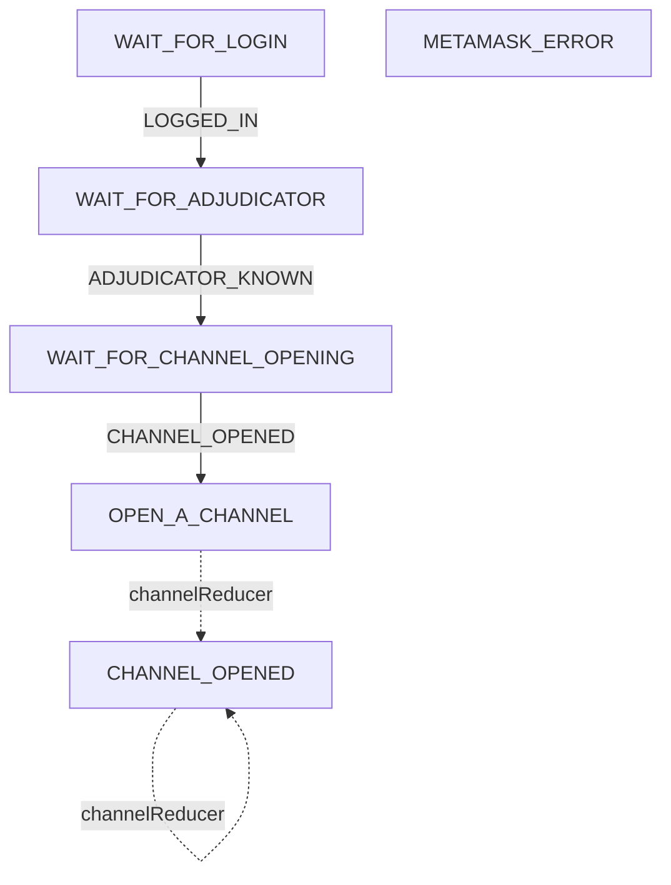
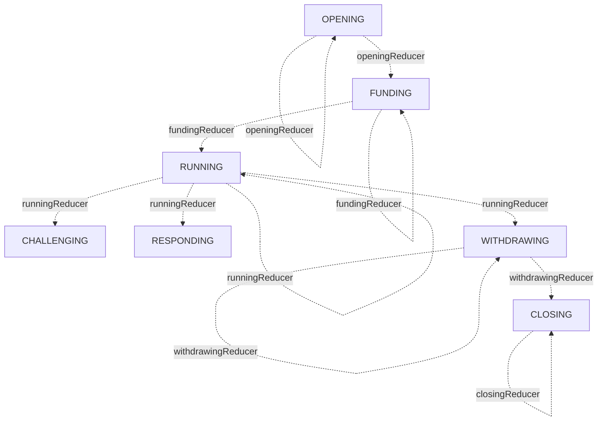
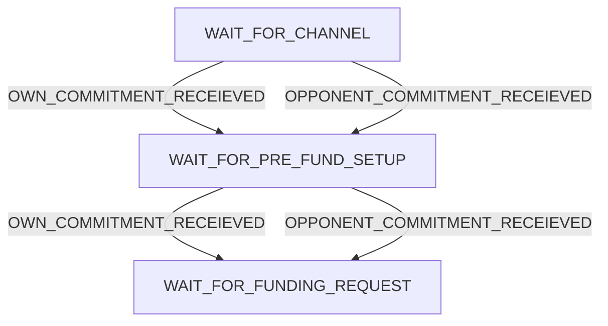
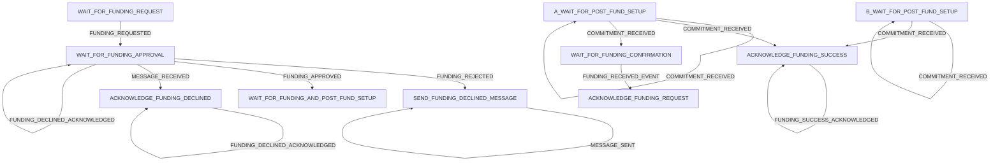
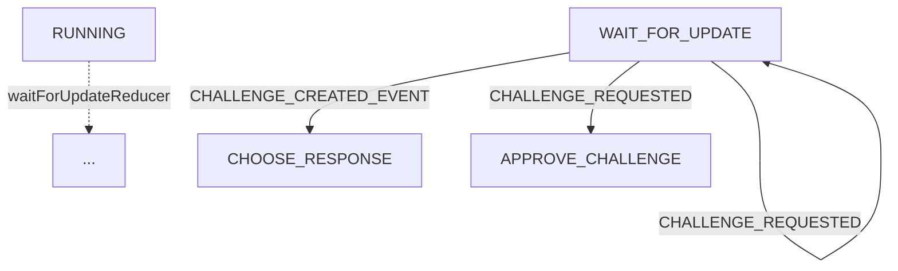
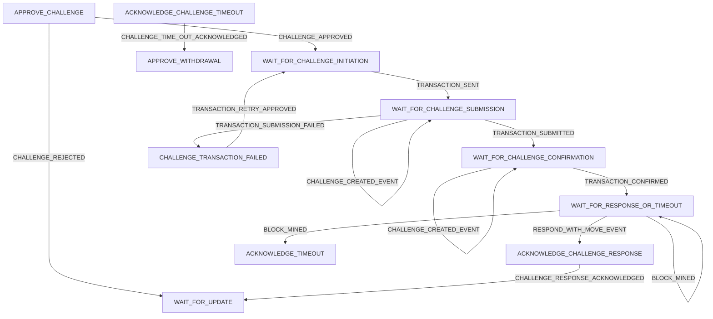
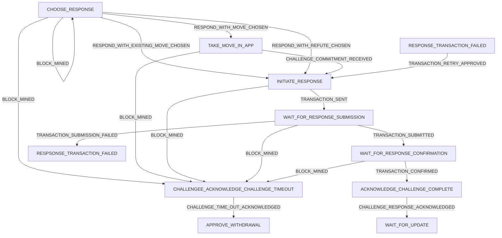
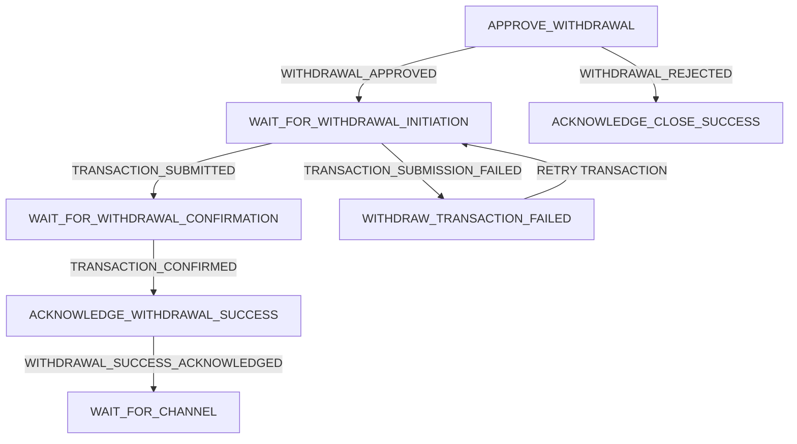
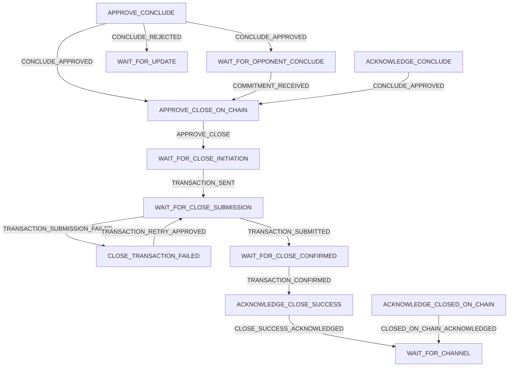

<!-- Recommend VSCode plugin
Name: Markdown Preview Mermaid Support
Id: bierner.markdown-mermaid
Description: Adds Mermaid diagram and flowchart support to VS Code's builtin markdown preview
Version: 1.1.2
Publisher: Matt Bierner
VS Marketplace Link: https://marketplace.visualstudio.com/items?itemName=bierner.markdown-mermaid -->

# Redux diagrams (desired state)

(using our conventions at https://magmo.gitbook.io/reference/developer-handbook/react-redux-conventions)

### Methodology

These flowcharts are made by constructing nodes from the _state types_ or (_stage types_ where indicated), from the relevant file in a `/states/` directory, and then constructing edges from the relationships defined in the relevant `/reducers/` directory. Edges are labelled with the _action types_ from the `/actions/` directory (or function calls such as other reducers), and the flowcharts suppress information about conditional checks that are performed by the reducers. Where useful, reducers have had their sub-reducers unpacked -- making for a fewer number of more complicated flowcharts. When a reducer returns the same state, these loops are also suppressed. Globally handled actions are also sometimes suppressed.

<!-- TODO: consider using the actual `string` value of the types, rather than the variable name. -->
<!-- TODO: related to ^, consider enforcing this string to be *exactly* the same as the type variable name -->
<!-- TODO: use hyperlinks / anchors to make this document easier to navigate. -->

### Key:

```mermaid
  graph LR
    STATE --> |ACTION| ANOTHER_STATE
    ANOTHER_STATE.->|functionCall| YET_ANOTHER_STATE
```

# Top level

[`/packages/wallet/src/redux/reducers/index.ts`](../src/redux/reducers/index.ts)

We initialize the wallet, but we open a channel.



TODO: side effects

# channelReducer

[`/packages/wallet/src/redux/reducers/channels/index.ts`](../src/redux/reducers/channels/index.ts)

These are values for `channelStage` rather than `type`:



## openingReducer

[`/packages/wallet/src/redux/reducers/channels/opening.ts`](../src/redux/reducers/channels/opening.ts)



# fundingReducer

[`/packages/wallet/src/redux/reducers/channels/funding/index.ts`](../src/redux/reducers/channels/funding/index.ts)



## runningReducer

[`/packages/wallet/src/redux/reducers/channels/running.ts`](../src/redux/reducers/channels/running.ts)



## challengingReducer

[`/packages/wallet/src/redux/reducers/channels/challenging/index.ts`](../src/redux/reducers/channels/challenging/index.ts)



## respondingReducer

[`/packages/wallet/src/redux/reducers/channels/responding/index.ts`](../src/redux/reducers/channels/responding/index.ts)



## withdrawingReducer

[`/packages/wallet/src/redux/reducers/channels/withdrawing/index.ts`](../src/redux/reducers/channels/withdrawing/index.ts)



## closingReducer

[`/packages/wallet/src/redux/reducers/channels/closing/index.ts`](../src/redux/reducers/channels/closing/index.ts)



# WIP

## directFunding

[`/packages/wallet/src/redux/reducers/channels/funding/directFunding.ts`](../src/redux/reducers/channels/funding/directFunding.ts`)

```mermaid
  graph TD
    WAIT_FOR_FUNDING_REQUEST -->|FUNDING_REQUESTED| WAIT_FOR_FUNDING_APPROVAL

    WAIT_FOR_FUNDING_APPROVAL -->|FUNDING_REJECTED| SEND_FUNDING_DECLINED_MESSAGE
    WAIT_FOR_FUNDING_APPROVAL -->|FUNDING_APPROVED| WAIT_FOR_FUNDING_AND_POST_FUND_SETUP
    WAIT_FOR_FUNDING_APPROVAL -->|MESSAGE_RECEIVED| ACKNOWLEDGE_FUNDING_DECLINED
    WAIT_FOR_FUNDING_APPROVAL -->|FUNDING_DECLINED_ACKNOWLEDGED| WAIT_FOR_FUNDING_APPROVAL

    A_WAIT_FOR_DEPOSIT_TO_BE_SENT_TO_METAMASK --> |TRANSACTION_SENT| A_SUBMIT_DEPOSIT_IN_METAMASK
    A_WAIT_FOR_DEPOSIT_TO_BE_SENT_TO_METAMASK --> |FUNDING_RECEIVED_EVENT| A_WAIT_FOR_DEPOSIT_TO_BE_SENT_TO_METAMASK

    A_SUBMIT_DEPOSIT_IN_METAMASK --> |FUNDING_RECEIVED_EVENT| A_SUBMIT_DEPOSIT_IN_METAMASK
    A_SUBMIT_DEPOSIT_IN_METAMASK --> |TRANSACTION_SUBMITTED| A_WAIT_FOR_DEPOSIT_CONFIRMATION
    A_SUBMIT_DEPOSIT_IN_METAMASK --> |TRANSACTION_SUBMISSION_FAILED| A_DEPOSIT_TRANSACTION_FAILED

    A_WAIT_FOR_DEPOSIT_CONFIRMATION --> |FUNDING_RECEIVED_EVENT| A_WAIT_FOR_DEPOSIT_CONFIRMATION
    A_WAIT_FOR_DEPOSIT_CONFIRMATION --> |TRANSACTION_CONFIRMED| A_WAIT_FOR_OPPONENT_DEPOSIT

    A_WAIT_FOR_OPPONENT_DEPOSIT --> |FUNDING_RECEIVED_EVENT| FUNDING_CONFIRMED

    B_WAIT_FOR_OPPONENT_DEPOSIT --> |FUNDING_RECEIVED_EVENT| B_WAIT_FOR_DEPOSIT_TO_BE_SENT_TO_METAMASK

    B_WAIT_FOR_DEPOSIT_TO_BE_SENT_TO_METAMASK --> |TRANSACTION_SENT| B_SUBMIT_DEPOSIT_IN_METAMASK

    B_SUBMIT_DEPOSIT_IN_METAMASK --> |TRANSACTION_SUBMITTED| B_WAIT_FOR_DEPOSIT_CONFIRMATION
    B_SUBMIT_DEPOSIT_IN_METAMASK --> |TRANSACTION_SUBMISSION_FAILED| B_DEPOSIT_TRANSACTION_FAILED

    B_WAIT_FOR_DEPOSIT_CONFIRMATION --> |TRANSACTION_CONFIRMED| FUNDING_CONFIRMED

    A_DEPOSIT_TRANSACTION_FAILED --> |TRANSACTION_RETRY_APPROVED| A_WAIT_FOR_DEPOSIT_TO_BE_SENT_TO_METAMASK

    B_DEPOSIT_TRANSACTION_FAILED --> |TRANSACTION_RETRY_APPROVED| B_WAIT_FOR_DEPOSIT_TO_BE_SENT_TO_METAMASK

    FUNDING_CONFIRMED

```


