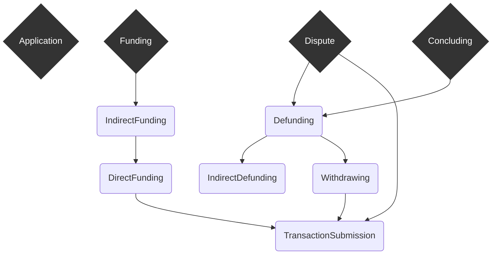

# Magmo wallet developer docs

- [Wallet architecture](./structuring-the-wallet.md)
- [Action routing](./action-routing.md)
- [Protocol Conventions](./protocol-conventions.md)

## Protocols

- [application](../src/redux/protocols/application/readme.md)
- [concluding](../src/redux/protocols/concluding/readme.md)
- [defunding](../src/redux/protocols/defunding/readme.md)
- [direct-funding](../src/redux/protocols/direct-funding/readme.md)
- [dispute](../src/redux/protocols/dispute/readme.md)
- [funding](../src/redux/protocols/funding/readme.md)
- [indirect-funding](../src/redux/protocols/indirect-funding/readme.md)
- [indirect-defunding](../src/redux/protocols/indirect-defunding/readme.md)
- [transaction-submission](../src/redux/protocols/transaction-submission/readme.md)
- [withdrawing](../src/redux/protocols/withdrawing/readme.md)

## Protocol Hierarchy

