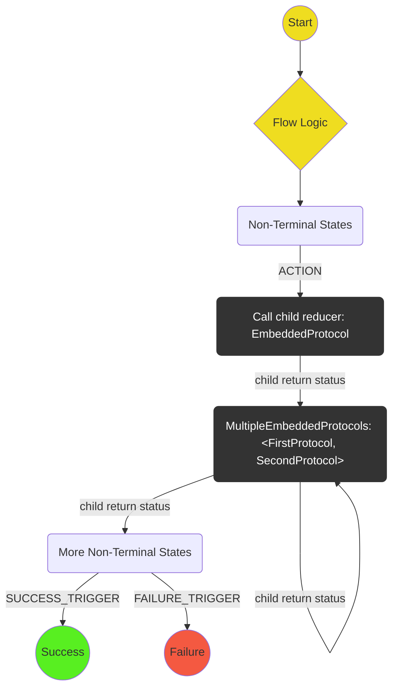
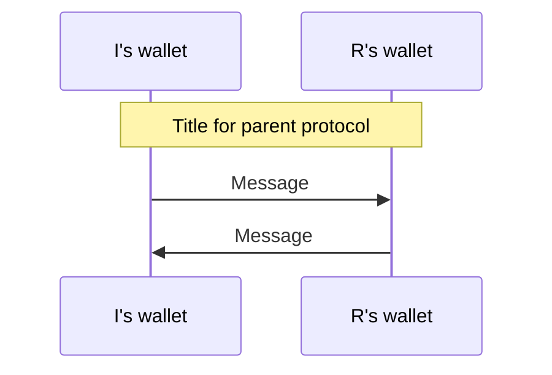

# Protocol Conventions

**[Home](./index.md)**

In this wallet client, a protocol is defined by a collection of files, in a named subdirectory of `/src/redux/protocols`:

- [`readme.md`](#state-machine-diagram), including a state machine diagram
- [`states.ts`](#states)
- [`actions.ts`](#actions)
- [`reducer.ts`](#reducer)
- [`index.ts`](#index)
- [`container.tsx`](#container)
- [`/__tests__/scenarios.ts`](#scenarios)
- [`/__tests__/reducer.test.ts`](#reducer-test)
- [`/__tests__/stories.tsx`](#stories)

## TODO list

This template can be used when planning work on a new protocol.

- [ ] Readme
- [ ] States
- [ ] Actions
- [ ] Reducer
- [ ] Index
- [ ] Container
- [ ] Scenarios
- [ ] Reducer test
- [ ] Stories

## State machine diagram

<a name="state-machine-diagram"></a>
Authoring a new protocol begins with a state machine diagram, using the following conventions:



Various scenarios -- namely, different routes through this state machine diagram -- should also be laid out. Scenarios need not repeat identical steps from prior scenarios.

Often it is useful to split a protocol into two subprotocols, one for each player. In that case, the subprotocols are subdirectories with their own readmes and state machine diagrams, and the parent directory should have a short readme explaining the interaction of the two sub state machines, possibly with the inclusion of a sequence diagram:



## States

<a name="states"></a>

Define an interface and constructor function for each state in the state machine diagram. For a protocol named `protocol`, the `type` property should be a string formatted as `Protocol.StateType`. Also define `TerminalProtocolState`, `NonTerminalProtocolState` and `ProtocolState` types as well as `isProtocolState` and `isTerminal` type guards. A `type ProtocolStateType = ProtocolState['type']` should be exported to enable type safety in tests and elsewhere.

To reduce boilerplate, simply enter the type string directly rather than defining a named constant string and using ~~`type: typeof CONSTANT_STRING`~~.

Constructor functions should be typed as `StateConstructor<InterfaceName>` by using `import { StateConstructor } from '../../utils';`.

## Actions

<a name="actions"></a>

Define an interface and constructor function for each action in the state machine diagram. For a protocol named `my-protocol`, the `type` property should be a string formatted as `WALLET.MY_PROTOCOL.ACTION_TYPE`. Pre-existing actions (e.g. from the communication module), may be imported if required. Also define the exported `NonTerminalMyProtocolAction` and `MyProtocolAction` union types as well as an `isMyProtocolAction` type guard. If a top level protocol, add `MyProtocolAction` to the `ProtocolAction` union (and make a corresponding change to the type guard). Otherwise, add `MyProtocolAction` to the `ParentProtocolAction` union (and it will thereby be included as a `ProtocolAction`). See the [Protocol Hierachy Diagram](./index.md#hierarchy).

Actions should have a `processId` property.

To reduce boilerplate, simply enter the type string directly rather than defining a named constant string and using ~~`type: typeof CONSTANT_STRING`~~.

Constructor functions should be typed as `ActionConstructor<InterfaceName>` by using `import { ActionConstructor } from '../../utils';`.

## Reducer

Should define an `initialize` function as well as a `protocolReducer` function, each returning type `{protocolState, sharedData}`. The main reducer function accepts `{protocolState, sharedData, action}` and should feature an exhaustive switch, either on the states or the actions of that protocol, which then calls subreducers. Helper functions should be imported and not replicated.

<a name="reducer"></a>

## Index

<a name="index"></a>

This file should export:

- `protocolReducer`
- `initialize`
  <!-- TODO -->

## Container

<a name="container"></a>
An exhasutive switch on state type, returning a suitable UI component. When waiting for a child protocol, display the child container.

Try and reuse components in `/src/redux/protocols/shared-components` as far as possible.

## Scenarios

<a name="scenarios"></a>
Objects containing the states, actions and commitments necessary to simulate each scenario described in the readme. May import triggers from child reducers. The format should be:

```typescript
// -------
// Scenarios
// -------

export const scenarioName = {
  ...defaults,
  firstProtocolState: {
    state: firstProtocolState,
    sharedData: sharedDataAtTimeOfFirstProtocolState,
    action: actionTriggeredWhenInFirstState,
  },
  secondProtocolState: {
    state: secondProtocolState,
    sharedData: sharedDataAtTimeOfSecondProtocolState,
    action: actionTriggeredWhenInSecondState,
    commitment: optional
  },
  andSoOn...
};

```

<!-- TODO -->

## Reducer test

<a name="reducer-test"></a>
Jest tests for each scenario. Helper functions should be imported and not replicated. The tests should assert:

- State transitions
- Display side effects
- Commitment side effects
  <!-- TODO -->

Use

```typescript
import { describeScenarioStep } from '../../../../__tests__/helpers';
```

This will print out the state and action in a unified format.

## Stories

<a name="stories"></a>
Screens should be added from each scenario, using the helper function

```typescript
import { addStoriesFromScenario as addStories } from '../../../../../__stories__';
```

which builds a full wallet dummy state around each `protocolState` in the scenario, and renders that into the top level wallet container. The function should automatically exclude terminal states (todo).

<!-- TODO -->
