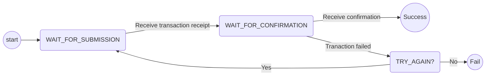
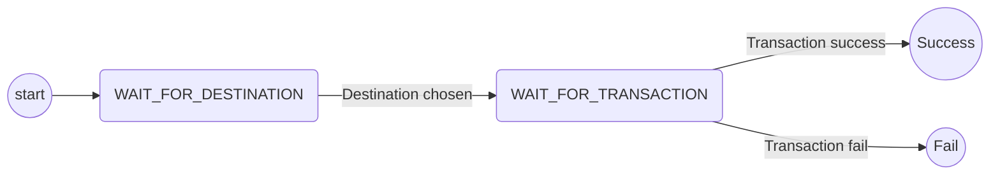
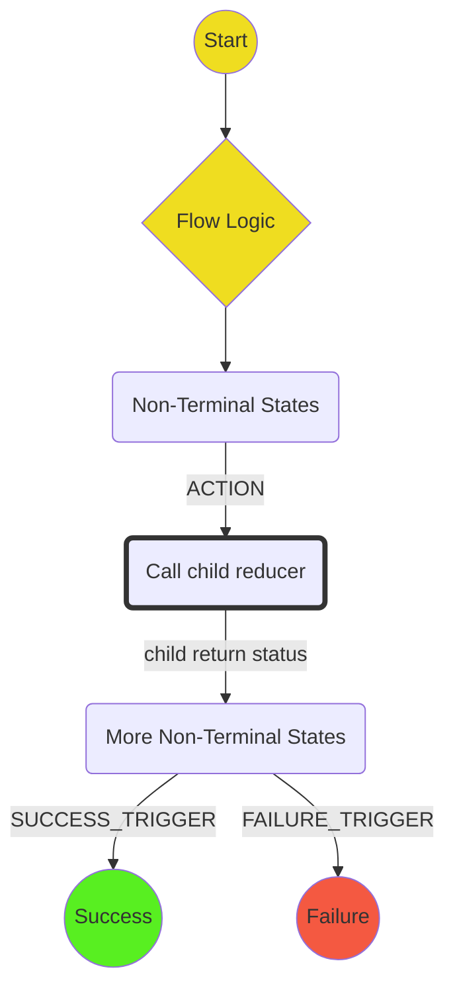

# Wallet Architecture

The wallet needs to be able to run many different protocols, potentially simultaneously.
For example, the wallet might need to be funding channel C1 with opponent A at the same time
as responding to a challenge on channel C2.
As we introduce state channel networks, some protocols will need involve interactions between
multiple channels. This means tha we must move beyond our approach to-date, where the
protocol was recorded as part of the channel state.

It is clear that the different protocols will have many areas of overlap.
Examples here include (a) submitting a transaction to the blockchain, which is part of
many different protocols and (b) directly funding a channel, which occurs independently
but can also occur as part of indirect funding, if we need to directly fund the ledger channel.
We need to find an architecture that allows us to reuse the shared logic in these cases,
while remaining simple and easy to understand.

This document gives a proposal for such an architecture.

## Protocols and Protocol composition

A **protocol** defines the series of interactions that must take place between participants
and the blockchain in order to accomplish a given outcome.
Examples of protocols include "funding a channel", "launching a challenge" and "withdrawing
funds".
The purpose of a wallet is to provide an _implementation_ for the protocols defined by the
framework.
The wallet provides this implementation by defining a state machine, where the states track
the progress made in executing the protocol.

As mentioned before, there is a lot of structure and overlap between the different protocols.
In the wallet, we represent this structure by embedding state machines inside each other.
For example, the state machine for submitting a transaction to the blockchain is as follows:



This might have the following states:

```ts
type TransactionState = WaitForSubmission | WaitForConfirmation | TransactionFailed | Success | Fail;

interface WaitForSubmission = {
  type: 'WAIT_FOR_SUBMISSION';
  transaction: string;
}
interface WaitForConfirmation = {
  type: 'WAIT_FOR_CONFIRMATION';
  transactionId: string;
  transaction: string;
}
interface TransactionFailed = {
  type: 'TRANSACTION_FAILED';
  reason: string;
  transaction: string;
}
interface Success = {
  type: 'SUCCESS';
}
interface Fail = {
  type: 'FAIL';
}
```

Suppose we then want to write a state machine for the withdrawal procedure:



The states here would be built _using the `TransactionState` above_:

```ts
type WithdrawalState = WaitForDestination | WaitForTransaction | Success | Fail;

interface WaitForDestination {
  type: 'WAIT_FOR_DESTINATION';
  channelId: string;
}
interface WaitForTransaction {
  type: 'WAIT_FOR_TRANSACTION';
  channelId: string;
  transactionState: TransactionState; // embed state machine from above
}
interface Success = {
  type: 'SUCCESS';
}
interface Fail = {
  type: 'FAIL';
}
```

Note that we are composing these processes at the code level rather than at the service level: all the data for the transaction state machine is stored inside the withdrawal state machine.

### Conventions

When writing protocol state machine diagrams, we use the following conventions:



## Processes

Processes are responsible for running protocol. Each process has a single top-level protocol, which will then embed further protocols as above.

Each process has an `processId`. The process id is used to route messages to the correct part of the wallet.
Two wallets running e.g. a funding process will share process id and include it on all messages between them.

The current state of the protocol's state machine will be stored against the `processId`.

```ts
interface ProcessState {
  processId: string;
  protocolState: ProtocolState;
  tab: string; // some identifier of the browser tab that requested it(?)
  // etd.
}
```

A wallet can run multiple processes at once.

## Shared State

I expect the wallet state to look something like:

```ts
interface WalletState {
  channelStore: {
    [channelId: string]: ChannelState;
  };
  outbox: Outbox;
  processStore: {
    [processId: string]: ProcessState;
  };
}
```

Processes have access to their own state and the wallet's shared state (but _not_ the state of other processes).

Shared wallet state currently includes the `channelStore` and the `outbox`.

## Triggering processes

There needs to be some top level handler whose responsibility it is to trigger processes in response to requests from the application.
For example:

1. User app requests channel be funded: `FUNDING_REQUESTED`
2. Top-level handler puts a new process in the `processStore` that runs the `Funding` protocol.
