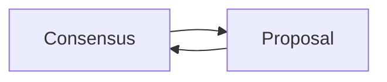

# Two player consensus game

Ledger channels run the consensus game. In the two player case, the consensus game has two types of state, with the following transitions (here $$\omega_1$$ and $$\omega_2$$ are outcomes):

1. Consensus($$\omega_1$$) $$\rightarrow$$ Proposal($$\omega_1$$, $$\omega_2$$) [propose a new outcome]
2. Proposal($$\omega_1$$, $$\omega_2$$) $$\rightarrow$$Consensus($$\omega_1$$) [veto proposal]
3. Proposal($$\omega_1$$, $$\omega_2$$) $$\rightarrow$$Consensus($$\omega_2$$) [accept proposal]
4. Consensus($$\omega_1$$) $$\rightarrow$$Consensus($$\omega_1$$) [pass (optional)]
5. Proposal($$\omega_1$$, $$\omega_2$$) $$\rightarrow$$ Proposal($$\omega_1$$, $$\omega_3$$) [propose a different new outcome (optional)]

The other important fact here is the default outcome for both Consensus($$\omega_1$$) and Proposal($$\omega_1$$, $$\omega_2$$) is $$\omega_1$$. This means that if a challenge is launched in either one of those states and there is no response before the timeout, then the outcome $$\omega_1$$ will be finalized in the adjudicator.

## Two players in our code

In our code, for 2-participant channels

- Consensus($$\omega_1$$) ↔ consensus counter = 0
- Proposal($$\omega_1$$, $$\omega_2$$) ↔ consensus counter = 1

For the time being, we will only support transitions 1, 2, 3 above. This means that player A will always be the proposer and player B will always be the vetoer/acceptor.

