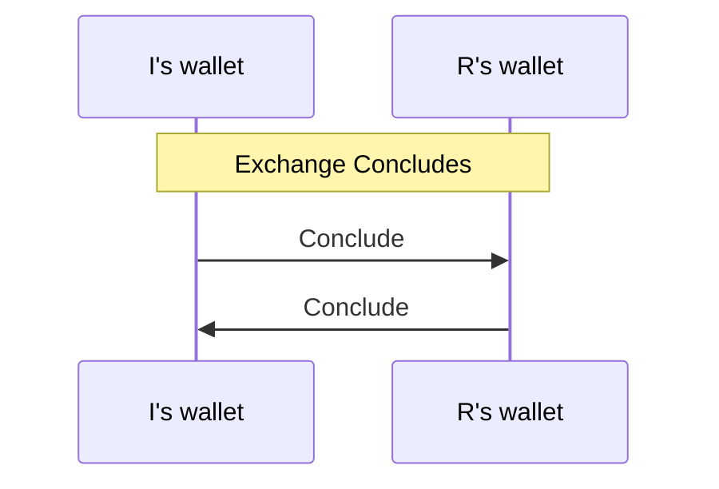

# Concluding

The concluding protocols coordinate the process of concluding a channel.

## The Protocol

The concluding protocol involves two parties: instigator and responder.
The instigator is identified by being a participant who has chosen to conclude the channel. The responder is a participant who has received a conclude commitment and responds in kind.

We therefore split the overall indirect-funding protocol into two sub state machines:
[instigator](./instigator/readme.md) and [responder](./responder/readme.md).

The two state machines interact through the following messages:

# Terminology

Use "Conclude" / "Concluding" everywhere, here. In an application, you might choose to Resign, or you (or an opponent) might run out of funds. In these cases, according to the wallet you are concluding the channel.

For now we will avoid "Resigning", "Closing" and so on.

We will also include the `Defunding` protocol as an optional subprotocol of `Concluding`. If `Defunding` fails, `Concluding` will still be considered to have also failed.
