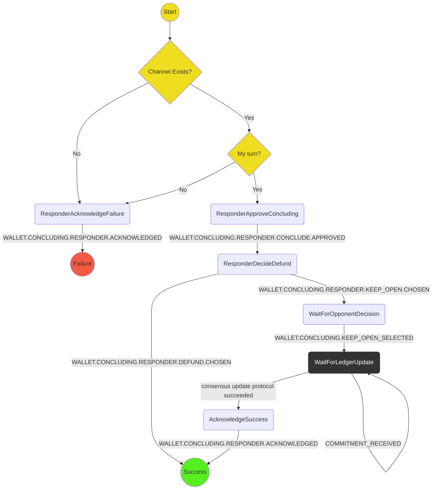

# Concluding Protocol (Responder)

The purpose of this protocol is to respond to the instigation of a concluding a channel, i.e. your opponent's transmission of a conclude commitment.

It covers:

- Assume a conclude commitment has already been received and a higher level process has then triggered this protocol
- Asking user to confirm the resignation (probably displaying the current outcome)
- Formulating the conclude state and sending to the opponent
- Acknowledge channel concluded (giving the option to defund)

Out of scope (for the time being):

- Allowing responder to not conclude

## State machine

The protocol is implemented with the following state machine

## Scenarios

We will use the following scenarios for testing:

1. **Happy path**: `ResponderApproveConcluding` -> `ResponderDecideDefund` -> `ResponderSuccess`
2. **Channel doesnt exist** `ResponderAcknowledgeFailure` -> `ResponderFailure`
3. **Concluding not possible**: `ResponderAcknowledgeFailure` -> `ResponderFailure`
4. **Defund failed** `ResponderWaitForDefund` -> `ResponderAcknowledgeFailure` -> `ResponderFailure`
