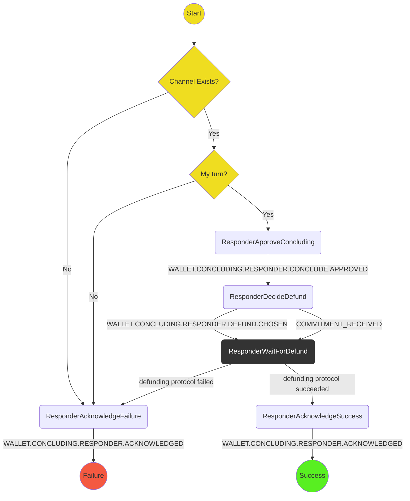

# Concluding Protocol (Responder)

The purpose of this protocol is to respond to the instigation of a concluding a channel, i.e. your opponent's move to a conclude state.

It covers:

- Assume a conclude commitment has already been received and a higher level process has then triggered this protocol
- Asking user to confirm the resignation (probably displaying the current outcome)
- Formulating the conclude state and sending to the opponent
- Acknowledge channel concluded (giving the option to defund)

Out of scope (for the time being):

- Allowing responder to not conclude
- Allowing the user to not choose to not defund

## State machine

The protocol is implemented with the following state machine

## Scenarios

We will use the following scenarios for testing:

1. **Happy path**: `ResponderApproveConcluding` -> `ResponderDecideDefund` -> `ResponderWaitForDefund` -> `ResponderAcknowledgeSuccess` -> `ResponderSuccess`
2. **Happy path (alternative)**
   As 1 but commitment received and handled by _this_ reducer
3. **Channel doesnt exist** `ResponderAcknowledgeFailure` -> `ResponderFailure`
4. **Concluding not possible**: `ResponderAcknowledgeFailure` -> `ResponderFailure`
5. **Defund failed** `ResponderWaitForDefund` -> `ResponderAcknowledgeFailure` -> `ResponderFailure`

# Terminology

Use "Conclude" / "Concluding" everywhere, here. In an application, you might choose to Resign, or you (or an opponent) might run out of funds. In these cases, according to the wallet you are concluding the channel.

For now we will avoid "Resigning", "Closing" and so on.

We will also include the `Defunding` protocol as an optional subprotocol of `Concluding`. If `Defunding` fails, `Concluding` will still be considered to have also failed.
