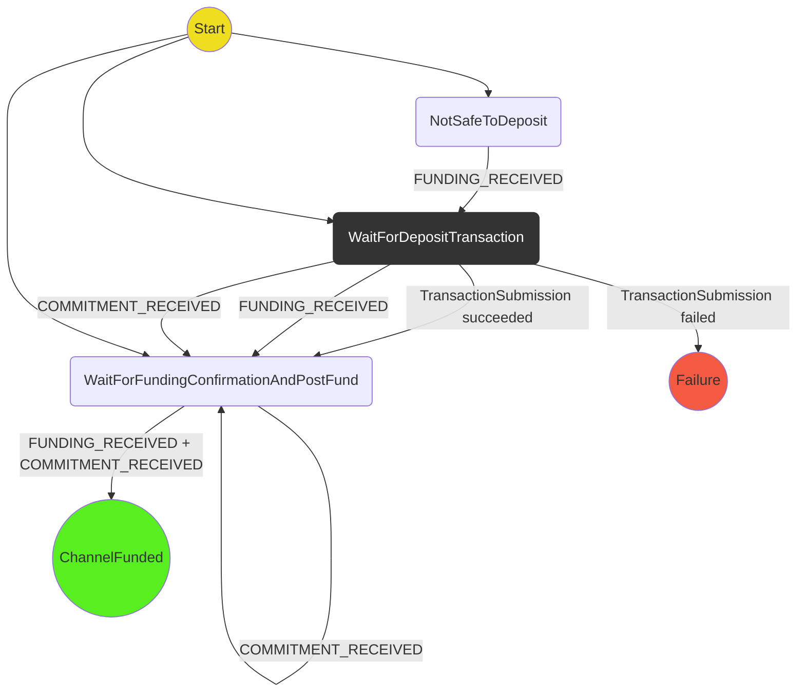

# Direct Funding Protocol

The direct funding protocol is one of the funding protocols, which means that the protocol progresses the channel from after the exchange of the PreFund setup states to where the participants are able to exchange PostFund states. The keeps track of adjudicator funding in order to track when it is safe to deposit funds.

## State Machine

The protocol implements the following state machine:

## Not covered by protocol for now

- If the transaction submission state machine fails, we do not retry the transaction.
- There are no protections against missing the blockchain funding events.

## Test scenarios

To test all paths through the state machine we will use the following scenarios:

1. **A-deposits-B-deposits-A**: `WaitForDepositTransaction` -> `WaitForConfirmationAndPostFund` -> `ChannelFunded`
2. **A-deposits-B-deposits-B**: `NotSafeToDeposit` -> `WaitForDepositTransaction` -> `WaitForConfirmationAndPostFund` -> `ChannelFunded`
3. **Transaction fails**: `WaitForDepositTransaction` -> `Failure`
