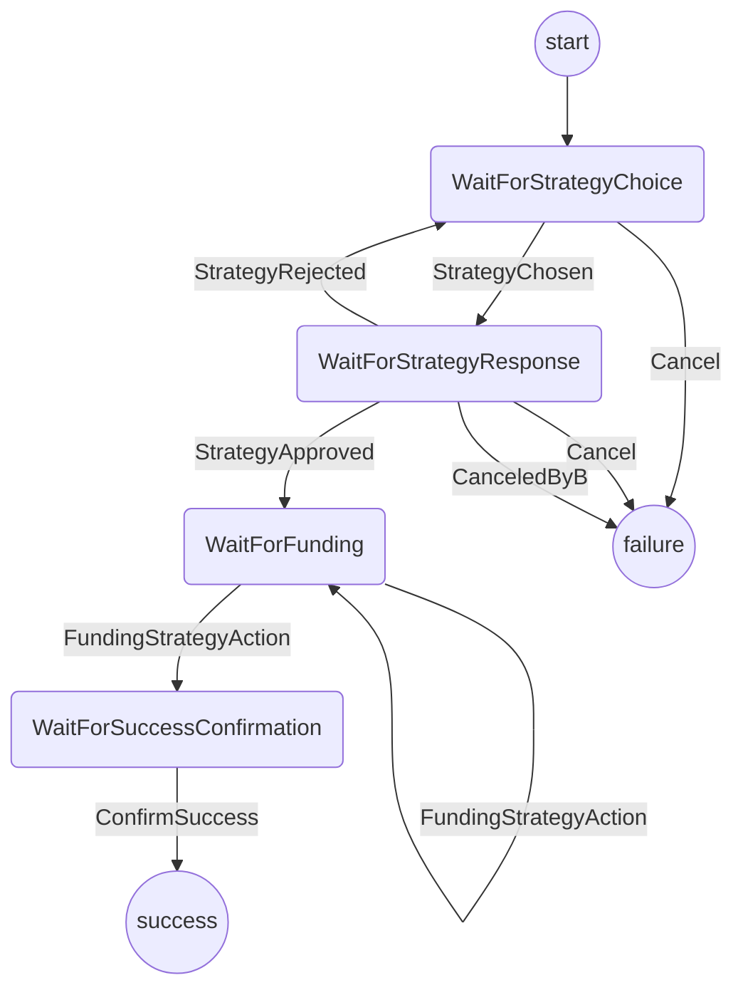
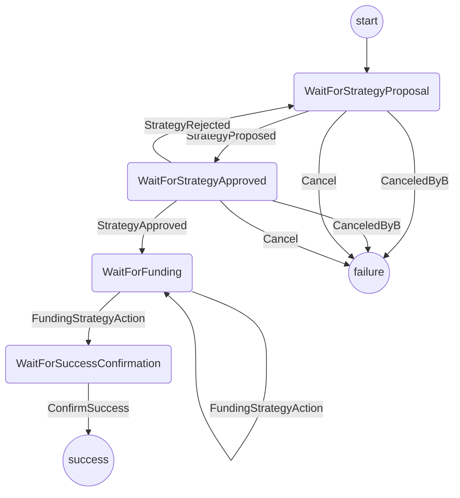

# Funding Protocol

The purpose of this protocol is to

1. Determine the funding strategy that will be used to fund a channel
2. Initialize the protocol for the corresponding strategy
3. Route further actions to that strategy's protocol

It should be triggered by the `FUNDING_REQUESTED` event from the app.
On success, it should send `FUNDING_SUCCESS` to the app.

Out of scope (for now):

- Supporting protocols other than indirect funding
- Recovering from a partially successful process

## State machine

The protocol is implemented with the following state machines

### Player A

### Player B

### Communication

