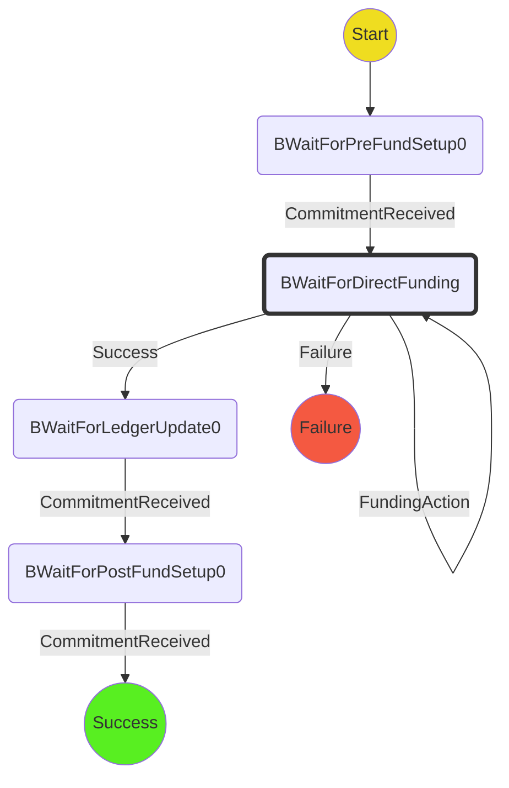

# Indirect Funding Protocol for Player B

### State Machine

### Scenarios

We will use the following two scenarios in tests:

1. **Happy path**: `WaitForPreFundL0` -> `WaitForDirectFunding` -> `WaitForLedgerUpdate0` -> `WaitForPostFund0` -> `Success`
2. **Ledger funding fails**: `WaitForDirectFunding` -> `Failure`
