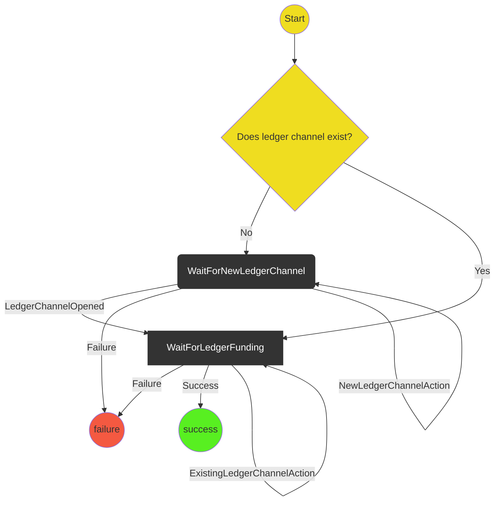

# Indirect Funding Protocol

The purpose of this protocol is to indirectly fund a channel using a ledger channel. This protocol initiates the `NewLedgerChannel` protocol when needed, and proceeds with the `ExistingLedgerFundingProtocol`.

# State machine

## Scenarios

1. **Existing Ledger Funding Happy Path**
   - Start
   - WaitForExistingLedgerFunding
2. **New Ledger Funding Happy Path**
   - Start
   - WaitForNewLedgerChannel
   - WaitForExistingLedgerFunding
   - Success
