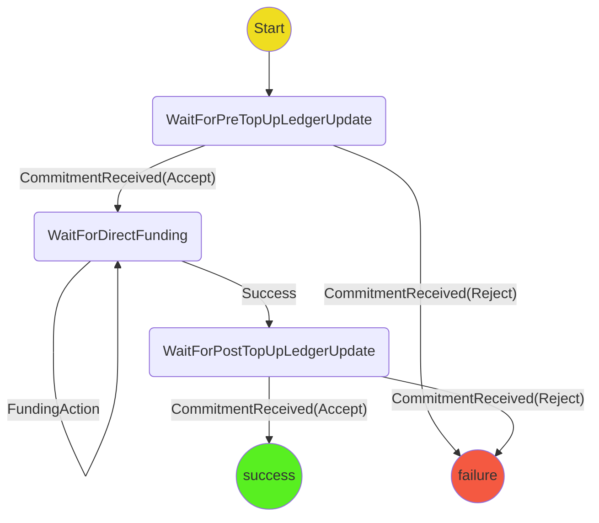

# Ledger Top Up Protocol

The purpose of the protocol is to top up an existing ledger channel so that it can be used to fund a game.

## State machine

## Scenarios

1. **Player A Happy Path** Start->WaitForPreTopUpLedgerUpdate->WaitForDirectFunding->WaitForPostTopUpLedgerUpdate->Success
2. **Player B Happy Path** Start->WaitForPreTopUpLedgerUpdate->WaitForDirectFunding->WaitForPostTopUpLedgerUpdate->Success
3. **Pre-TopUp Invalid Update** WaitForPreTopUpLedgerUpdate->Failure
4. **Post-TopUp Invalid Update** WaitForPostTopUpLedgerUpdate->Failure

TODO: Should we have a scenario for cases where only one player needs to top up?
