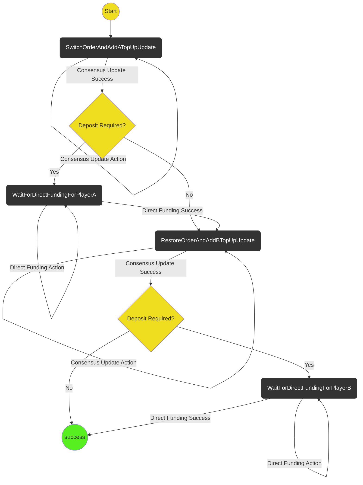

# Ledger Top Up Protocol

The purpose of the protocol is to top up an existing ledger channel so that it can be used to fund a game.

The protocol only handles performing a top up with two players. It works by:

1. Adding the top-up value to player A's allocation and moving it to the end via the consensus update protocol. The channel is underfunded after this but since A's allocation is last they are prevented from withdrawing too much.
2. Running the direct funding protocol for player A's deposit. The channel is now funded.
3. Adding the top-up value to player B's allocation and moving it to the end via the consensus update protocol. This restores the order and also protects player A.
4. Running the direct funding protocol for player B's deposit. The channel is now funded.

If a player has enough funds in the ledger channel already then we skip running the direct funding protocol for that player.
For example if we have a current allocation of `[A:2,B:5]` and a proposed allocation of `[A:5,B:5]` we would skip step 4 as there is no need for player B to deposit.

## State machine

## Scenarios

1. **Player A Happy Path** Start->SwitchOrderAndAddATopUpUpdate->WaitForDirectFundingForPlayerA->RestoreOrderAndAddBTopUpUpdate->WaitForDirectFundingForPlayerB->Success
2. **Player B Happy Path** Start->SwitchOrderAndAddATopUpUpdate->WaitForDirectFundingForPlayerA->RestoreOrderAndAddBTopUpUpdate->WaitForDirectFundingForPlayerB->Success
3. **(Player A) One user needs top-up** Start->SwitchOrderAndAddATopUpUpdate->WaitForDirectFundingForPlayerA->RestoreOrderAndAddBTopUpUpdate->Success
4. **(Player B) One user needs top-up** Start->SwitchOrderAndAddATopUpUpdate->WaitForDirectFundingForPlayerA->RestoreOrderAndAddBTopUpUpdate->Success
