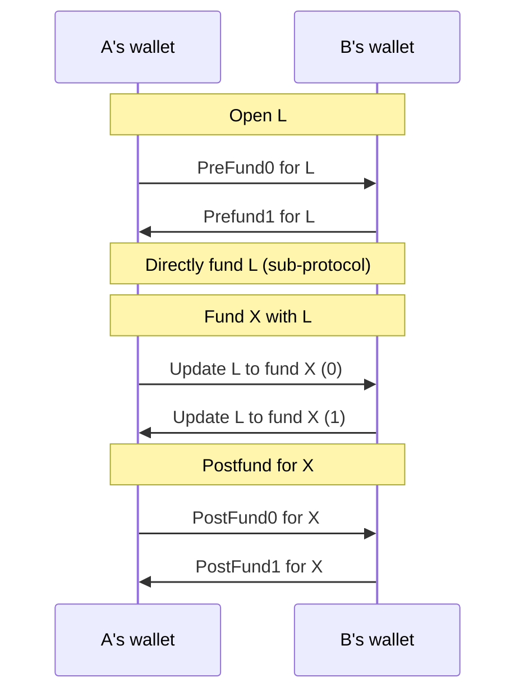

# New Ledger Funding

The new ledger funding protocol coordinates the process of funding an application channel, X, via a ledger channel, L.

- Opening + funding the ledger channel
- Updating the ledger channel to fund the the application channel

Out of scope (for now):

- Using an existing ledger channel if one is available
- Handling the case where an opponent stalls mid-protocol

## The Protocol

The indirect funding protocol involves two parties: player A and player B.
Player A is identified by being the first participant in the `participants` array in
the application channel X that is to be funded.

We therefore split the overall indirect-funding protocol into two sub-protocols: the
[player-a-indirect-funding protocol](./player-a/readme.md) and the [player-b-indirect-funding protocol](./player-b/readme.md).

The two protocols interact through the following messages:

