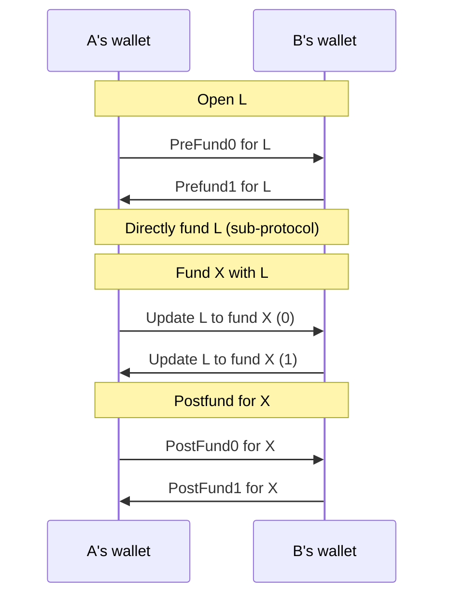
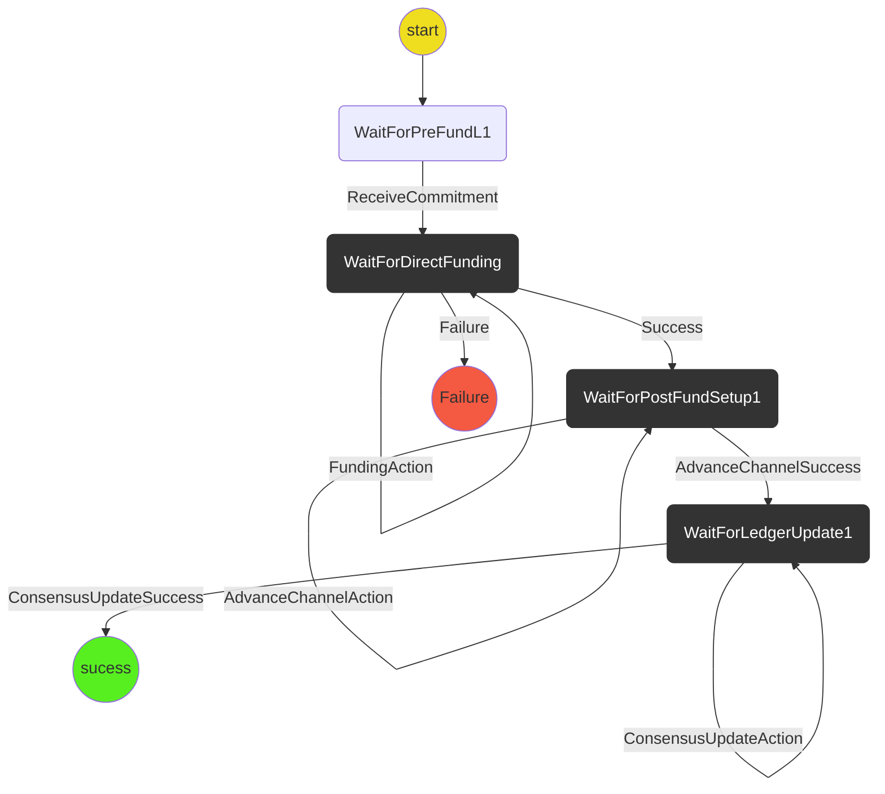

# New Ledger Funding

The new ledger funding protocol coordinates the process of funding an application channel, X, via a ledger channel, L.

- Opening + funding the ledger channel
- Updating the ledger channel to fund the the application channel

Out of scope (for now):

- Handling the case where an opponent stalls mid-protocol

## The Protocol

The protocol interacts between client wallets through the following messages:

### State Machine

### Scenarios

We will use the following two scenarios in tests:

1. **Happy path**: `WaitForPreFundL1` -> `WaitForDirectFunding` -> `WaitForLedgerUpdate1` -> `WaitForPostFund1` -> `Success`
2. **Ledger funding fails**: `WaitForDirectFunding` -> `Failure`
