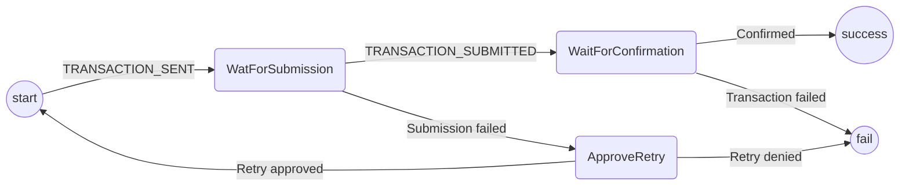

# Transaction Submission Protocol

The purpose of this protocol is to submit a transaction to the blockchain.
It covers:

- Sending the transaction to Metamask
- Waiting for confirmation
- Retrying in the case of a transaction failure

Out of scope (for the time being):

- Communicating progress to other participants (if required)
- Waiting for finalization (for the transaction to be n blocks deep)
- Handling chain reorgs
- Resubmitting transaction with higher gas if taking too long

## State machine

The protocol is implemented with the following state machine

