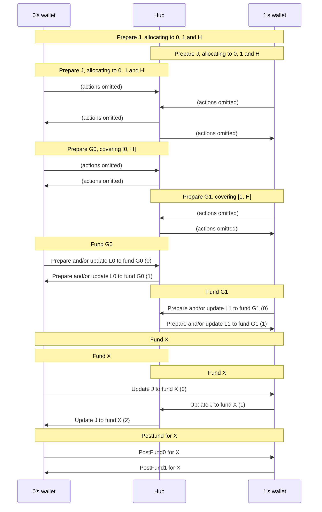
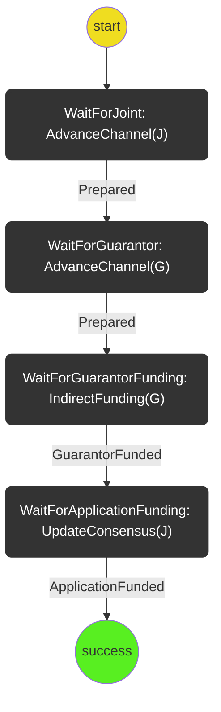

# Virtual Funding

The virtual funding protocol coordinates the process of funding an application channel,
X by a virtual channel, J, covered by two guarantor channels G0, G1, that are funded by
ledger channels L0, L1, respectively.

- Preparing the required guarantor channel.
- Preparing the virtual channel that allocates first to the application channel and then to the hub.
- Updating the guarantor channel to cover the virtual channel's outcome
- Preparing and/or updating the ledger channel to fund the guarantor channel

### Decisions

1. Each participant only sends commitments to the next participant. This makes communication predictable in a 3-way channel. (This decision will actually apply to the `AdvanceChannel` and `UpdateConsensus` protocols, and not directly to the virtual funding protocol)

2. The post-fund-setup phase is redundant when preparing G or J -- as consensus channels, allocations cannot change until a full round anyway. Therefore, we progress G and J straight to application phase phase. This decision will actually apply to the `AdvanceChannel` protocol, and not directly to the virtual funding protocol. However, this precludes the need to further update these channels after the indirect-funding step.

## The Protocols

The virtual funding protocol involves three parties: player 0, player 1, and the hub H.
Player 0 is identified by being the participant at index 0 in the `participants` array in
the application channel X that is to be funded.

In the following overview diagram, some communication related to embedded protocols are omitted.

## State machine diagram

