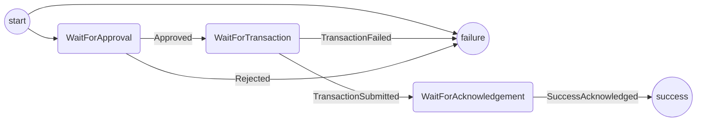

# Withdrawing Protocol

The purpose of this protocol is to withdraw funds from a directly funded channel.
It covers:

- Checking that a channel is closed.
- Displaying to the user the funds allocated to them in the channel,
- Getting approval from the user to proceed
- Sending the withdraw + conclude to the blockchain
- Getting acknowledgement from the user when done

Out of scope (for the time being):

- Retrying a transaction on failure.
- Displaying an error message to the user on transaction failure.
- Checking if a finalized outcome exists on chain(This will probably require a new saga).

## State machine

The protocol is implemented with the following state machine

Notes:

- In the code, all the withdrawal specific actions are prefixed with the word "Withdrawal"
- If the channel is not closed we transition directly to the failure state.

## Test Scenarios

1. Happy path: WaitForApproval -> WaitForTransaction -> WaitForAcknowledgement -> Success
2. Withdrawal Rejected: WaitForApproval -> Failure
3. Transaction failure: WaitForApproval -> WaitForTransaction -> Failure
4. Channel not closed failure: Initializes to Failure
