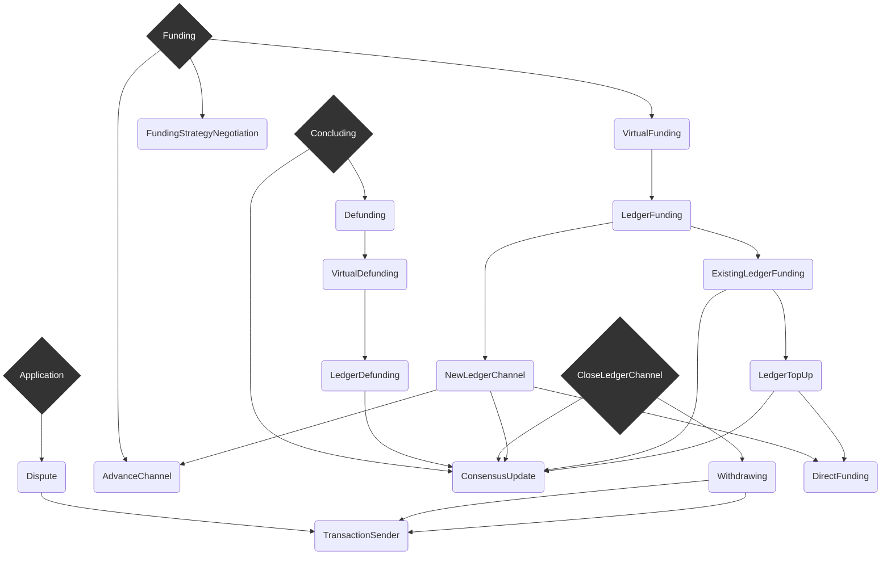

# Wallet developer docs

- [Wallet architecture](./structuring-the-wallet.md)
- [Action routing](./action-routing.md)
- [Protocol Conventions](./protocol-conventions.md)

## Protocols

- [advance-channel](../src/redux/protocols/advance-channel/readme.md)
- [application](../src/redux/protocols/application/readme.md)
- [close-ledger-channel](../src/redux/protocols/close-ledger-channel/readme.md)
- [concluding](../src/redux/protocols/concluding/readme.md)
- [consensus-update](../src/redux/protocols/consensus-update/readme.md)
- [defunding](../src/redux/protocols/defunding/readme.md)
- [direct-funding](../src/redux/protocols/direct-funding/readme.md)
- [dispute](../src/redux/protocols/dispute/readme.md)
- [existing-ledger-funding](../src/redux/protocols/existing-ledger-funding/readme.md)
- [funding](../src/redux/protocols/funding/readme.md)
- [funding-strategy-negotiation](../src/redux/protocols/funding-strategy-negotiation/readme.md)
- [ledger-defunding](../src/redux/protocols/ledger-defunding/readme.md)
- [ledger-funding](../src/redux/protocols/ledger-funding/readme.md)
- [ledger-top-up](../src/redux/protocols/ledger-top-up/readme.md)
- [new-ledger-channel](../src/redux/protocols/new-ledger-channel/readme.md)
- [prepare-channel](../src/redux/protocols/prepare-channel/readme.md)
- [transaction-submission](../src/redux/protocols/transaction-submission/readme.md)
- [virtual-funding](../src/redux/protocols/virtual-funding/readme.md)
- [virtual-defunding](../src/redux/protocols/virtual-funding/readme.md)
- [withdrawing](../src/redux/protocols/withdrawing/readme.md)
  

## Protocol Hierarchy

