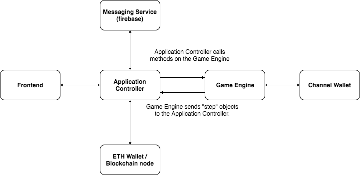

## The Game Engine

The Game Engine is responsible for storing the current state of the game and providing that information to the application controller.

The Application Controller is responsible for taking the next steps according to the state provided by the Game Engine and reporting back with the results. This could involve communicating with the opponent and/or the blockchain and/or rendering UI to get input from the user.



Here's an example of how the Application Controller would interact with the game engine. All of what follows takes place in the player A's Application Controller:

```js
ge = RPSEngine.new(addressOfLibrary)
state = ge.startGame(wallet, opponent, stake, initialBalances)
state // ReadyToSendPreFundProposal(initialMessage)
```
The Application Controller (AC) starts by creating a new game engine for the game in question. If the `addressOfLibrary` doesn't match the address that the `RPSEngine` expects, this operation should probably error.

The AC then starts the game, passing in details of the opponent etc. The GE sets up the channel and returns a state. The state that the GE returns contains the first message, representing the first `PREFUNDSETUP` state.

The AC then sends the message to the opponent and reports back to the GE:
```js
ge.preFundProposalSent() // AwaitingPreFundResponse(initialMessage)
```
The GE responds with a new state. The AC updates the UI accordingly and listens for the opponent's response. The GE has provided the AC with the `initialMessage` again, so that the AC can re-send to the opponent if required.

When the opponent's message arrives, the AC notifies the GE:
```js
ge.pushMessage(opponentsMessage) // ReadyToDeployAdjudicator(deploymentTransaction)
```
The GE responds with a new state, telling the AC that the next stop is to deploy the adjudicator, along with a transaction to accomplish that.

The GE interacts with the regular ETH wallet, to sign the transaction and send it to the blockchain. It then reports back to the GE:
```js
ge.deployTransactionSent() // AwaitingDeploymentConfirmation()
```
In this new state, the AC will monitor the blockchain. When it sees the event confirming that the adjudicator was created, it notifies the GE:
```js
ge.pushEvent(deploymentEvent) // AwaitingOpponentDeposit()
```
The `deploymentEvent` contains the address of the adjudicator, which the GE needs to know in case it needs to craft a force-move transaction in the future.

The AC then monitors the blockchain again, until it sees the event confirming that the opponent deposited:
```js
ge.pushEvent(opponentsDepositEvent) // ReadyToSendPostFundConfirmation(postFundConfirmationMessage)
```
Once the opponent has deposited, the next step is to send the `postFundConfirmationMessage`. The GE provides this to the AC in the new state. The AC sends this to the opponent and notifies the GE:
```js
ge.postFundConfirmationSent()// AwaitingPostFundConfirmationResponse()
```
The GE responds, telling the AC to wait for the response. When it arrives, the AC notifies the GE:
```js
ge.pushMove(message) // ReadyToChoosePlay()
```
The new state tells the AC to display the "choose your move" screen to the user. When the user makes their choice, the AC notifies the GE:
```js
ge.choose("rock")  // ReadyToSendPlay(message)
```
The GE then crafts the message to send to the opponent. In doing this it generates the `salt` and the `preCommit`. It stores the player's move, as it will need it later to craft the reveal message.

When the AC has sent the message to the opponent it notifies the GE:
```js
ge.playSent() // AwaitingOpponentsPlay()
```
The new state tells the AC to wait for the opponent's move. When it arrives the AC notifies the GE.
```js
ge.pushMove(opptsMove) // ReadyToSendReveal(revealMove)
```
The GE then crafts the `revealMove`, calculating the winnings etc. and provides this to the AC, who sends it to the user and notifies the GE:
```js
ge.revealSent() // AwaitingRoundConclusion()
```
The GE instructs the AC to wait for the opponent's message.

