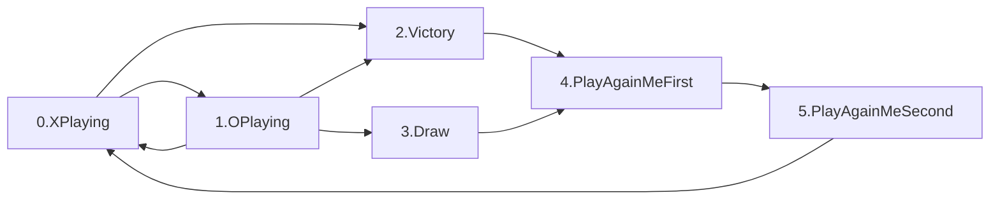

<!-- Recommend VSCode plugin 
Name: Markdown Preview Mermaid Support
Id: bierner.markdown-mermaid
Description: Adds Mermaid diagram and flowchart support to VS Code's builtin markdown preview
Version: 1.1.2
Publisher: Matt Bierner
VS Marketplace Link: https://marketplace.visualstudio.com/items?itemName=bierner.markdown-mermaid -->
# validTransition diagram

### Methodology
These flowcharts are made by constructing nodes from the *position types*  from the relevant application commitment solidity file in the `/contracts/` directory, and then constructing edges from the valid transitions defined in the relevant application rules solidity file.

Note that this state machine is transitioned alternately by the two players (cyclicly by n players). This is quite different from a redux state machine, which is transitioned by a single player.

### Key: 

# validTransition
[`/contracts/TicTacToeGame.sol`](..contracts/TicTacToeGame.sol)

