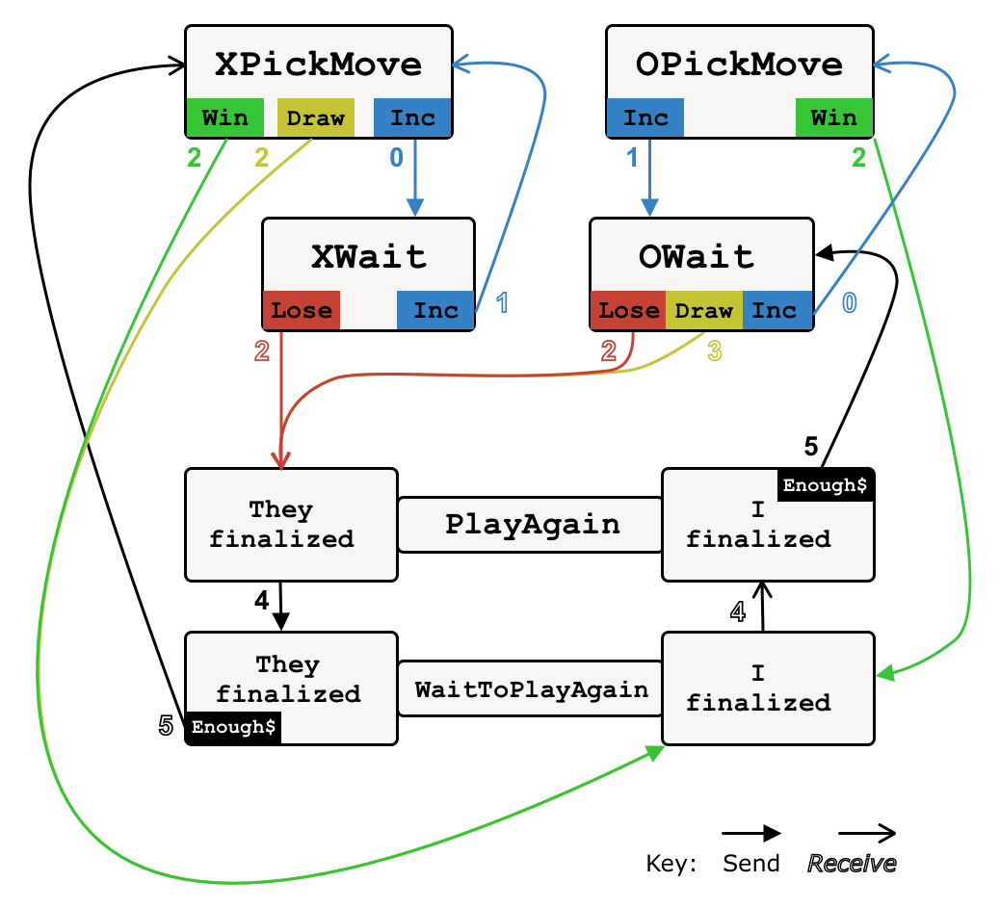

# App logic for TTT and RPS
Having the `validTransition` contract coded in solidity, along with the contracts imported from `fmg-core`, completes the necessary smart contracts for the state channel. Users could certainly play TTT off-chain and enjoy all the benefits of state channels (trustless, low cost, low latency and instant finality). The app itself, which the remainder of this document focusses on, is **simply a convenient way of visualising, sending and receiving appropriately encoded state channel positions**. Nevertheless, it arguably represents a much larger chunk of work for the state channel application developer than does authoring the smart contracts.

The application needs to achieve multiple taks:

* Present a front-end interface to users so that they can propose and accept games, make moves, and launch and respond to challenges.
* Sign, post and retrieve messages to instances of the app running on other player's clients (browsers). The messaging protocol could be almost anything: carrier-pigeon, SMS, semaphore. We are going to use a cloud-based database (firebase) for the purposes of these proofs of concept. 
* Interact with the blockchain when necessary.

> A *channel wallet* can do much of the heavy-lifting of veryifying, signing and storing states, as well as interfacing with the blockchain in the case of setup and teardown of channels, as well as challenges. Our open-source implementation, the [Magmo wallet](https://github.com/magmo/apps/tree/master/packages/wallet) is ready for you to use!

The applications are written in [TypeScipt](https://www.typescriptlang.org) a) because it compiles to JavaScript and b) it is a typed language. The first property is important, since JavaScript code can run in the clients browser, and a state channel is designed to be a peer-to-peer protocol in the spirit of the decentralized web. The second property helps the application code follow the solidity code more closely, and provides all of the development benefits of a typed language (autocompletion and date type protection in your IDE, compile-time rejection of errors) with almost no performance cost (with respect to JavaScript).

We need to write some TypeScript to encode and decode the channel state. This allows the very rigid and minimal formatting of the channel state in solidity to be cast into a more flexible and verbose expression of state that is much more amenable to app development.

The coding needs to follow the conventions set out in the `validTransition` function and its helpers, as well as the conventions set out in `fmg-core`.

Start with `/src/core/positions.ts`. We are going to define several *interfaces*, which will define precissely which properties each position should have. The positions in question are those defined in the gamestate (above) as well as two special positions from the ForceMove protocol: `PreFundSetup` and `PostFundSetup`. We need a copy of this state for each of the n players (here n=2). See Figure 4 of the ForceMove whitepaper:


In RPS, this TypeScript file imports some helpers from `fmg-core`, as well as `web3-utils` and a local file `moves.ts` . 

For any state channel, we will need the `Base` interface:

```typescript
// Properties shared by every position
interface Base {
  libraryAddress: string;
  channelNonce: number;
  participants: [string, string];
  turnNum: number;
  balances: [string, string];
}
```
all other position types will be extensions of this position type (meaning that they have the properties above plus some more). 

```typescript
export type Position = (
  | PreFundSetupA
  | PreFundSetupB
  | PostFundSetupA
  | PostFundSetupB
  | Propose
  | Accept
  | Reveal
  | Resting
  | Conclude
);
```
This lists all possible positions, some of which are core ForceMove positions, and some of which are Game Positions. 

> Clearer separation of these positions is something we may wish to introduce in the future (for example replace this type with a union of ForceMovePositions and GamePositions). 

The next thing that happens in this file is the definition of Position Constructors. These are functions that return instances of the above types when fed with any object that includes the correct properties. This is achieved with the help of the following interface:

```typescript
interface BaseParams extends Base {
  [x: string]: any;
}
```

the `any` type enables us to opt out of type checking (allowing data of any type to pass). 

> There is a more elegant way of doing this. See https://github.com/magmo/rps-poc/commit/77a5b112434a197f19a416d36cf7c0d26641de34 . 

The pattern of defining nested interfaces, along with constructor functions that allow one to 'project out' the required parameters from a larger collection, is one that we will be havily relying on. 


### Example correspondence beetween solidity and typescript

In `rps/src/core/results.ts` we have 

```typescript
export function calculateResult(yourMove: Move, theirMove: Move): Result {
  const x = (yourMove - theirMove + 2) % 3;
  switch (x) {
    case 0:
      return Result.YouWin;
    case 1:
      return Result.YouLose;
    default:
      return Result.Tie;
  }
}
```
which is an expression of the core game logic of RPS, and reproduces (essentially) the corresponding function written into the smart contract.

> The app and/or wallet obviously need to be aware of (or perhaps even *precisely mirror*) the functions enshrined in the smart contracts. There are several possibilities for achieving this, including emulating solidity from within javascript or by making a read-only call to a contract that has been deployed to a blockchain. 

In the front end TTT app, me must keep track of which player is crosses, since as discussed above this is not fixed in any given channel (or though it is of course fixed for the duration of a round). It is not necessary to include this information in the state of the channel itself. 

To get into the draw position, we will require the board to be full. Only Xs can do this, since they always move first. 

## Example game
In `/src/core/test-scenarios.ts` we will define a sequence of states, to be signed alternately by each player and representing an entire run through of the happy path of Tic Tac Toe:

```typescript
  preFundSetupA: positions.preFundSetupA({
    ...base,
    turnNum: 0,
    balances: fiveFive,
    stateCount: 0,
  }),
  preFundSetupB: positions.preFundSetupB({
    ...base,
    turnNum: 1,
    balances: fiveFive,
    stateCount: 1,
  }),
  postFundSetupA: positions.postFundSetupA({
    ...base,
    turnNum: 2,
    balances: fiveFive,
    stateCount: 0,
  }),
  postFundSetupB: positions.postFundSetupB({
    ...base,
    turnNum: 3,
    balances: fiveFive,
    stateCount: 1,
  }),
  playing1: positions.xPlaying({
    ...base,
    turnNum: 4,
    noughts: 0b000000000,
    crosses: 0b100000000,
    balances: sixFour,
  }),
  playing2: positions.oPlaying({
    ...base,
    turnNum: 5,
    noughts: 0b000010000,
    crosses: 0b100000000,
    balances: fourSix,
  }),
  playing3: positions.xPlaying({
    ...base,
    turnNum: 6,
    noughts: 0b000010000,
    crosses: 0b100000001,
    balances: sixFour,
  }),
  playing4: positions.oPlaying({
    ...base,
    turnNum: 7,
    noughts: 0b000011000,
    crosses: 0b100000001,
    balances: fourSix,
  }),
  playing5: positions.xPlaying({
    ...base,
    turnNum: 8,
    noughts: 0b000011000,
    crosses: 0b100100001,
    balances: sixFour,
  }),
  playing6: positions.oPlaying({
    ...base,
    turnNum: 9,
    noughts: 0b000011100,
    crosses: 0b100100001,
    balances: fourSix,
  }),
  playing7: positions.xPlaying({
    ...base,
    turnNum: 10,
    noughts: 0b000011100,
    crosses: 0b101100001,
    balances: sixFour,
  }),
  playing8: positions.oPlaying({
    ...base,
    turnNum: 11,
    noughts: 0b010011100,
    crosses: 0b101100001,
    balances: fourSix,
  }),
  draw: positions.draw({
    ...base,
    turnNum: 12,
    noughts: 0b010011100,
    crosses: 0b101100011,
    balances: fiveFive,
  }),
  againMF: positions.playAgainMeFirst({ ...base, turnNum: 13, balances: fiveFive }),
  conclude: positions.conclude({ ...base, turnNum: 14, balances: fiveFive }),
```

> What is statecount? It's in the prefundsetup and postfundsetup stages, to check everyone in the channel has agreed and funded it.

 The balances are defined elsewhere in this file, as are the base parameters shared by all of these states. As an example, considered the encoded version of one of these states:

 ```typescript
     playing4Hex:
    "0x" +
    "0000000000000000000000001111111111111111111111111111111111111111" + // libraryAdress
    "0000000000000000000000000000000000000000000000000000000000000004" + // channelNonce
    "0000000000000000000000000000000000000000000000000000000000000002" + // number of participants
    "000000000000000000000000aaaaaaaaaaaaaaaaaaaaaaaaaaaaaaaaaaaaaaaa" + // asAddress
    "000000000000000000000000bbbbbbbbbbbbbbbbbbbbbbbbbbbbbbbbbbbbbbbb" + // bsAddress
    "0000000000000000000000000000000000000000000000000000000000000002" + // StateType (PreFundSetup, PostFundSetup, Game, Conclude)
    "0000000000000000000000000000000000000000000000000000000000000007" + // turnNum
    "0000000000000000000000000000000000000000000000000000000000000000" + // stateCount ?
    "0000000000000000000000000000000000000000000000000000000000000004" + // aResolution
    "0000000000000000000000000000000000000000000000000000000000000006" + // bResolution
    "0000000000000000000000000000000000000000000000000000000000000001" + // [GameAttributes: GamePositionType = {xPlaying, oPlaying, Victory, Draw, PlayAgainMeFirst, PlayAgainMeSecond}
    "0000000000000000000000000000000000000000000000000000000000000001" + // [GameAttributes: roundBuyIn]
    "0000000000000000000000000000000000000000000000000000000000000018" + // [GameAttributes: noughts
    "0000000000000000000000000000000000000000000000000000000000000101",  // [GameAttributes: crosses]
 ```

 This raw data, along with an appropriate signature, is what is actually broadcast in the state channel, and could be used to raise a challenge on chain. We must now write functions that will appropriately convert between these two represenations-- on the one hand, TypeScript interfaces containing human-readable properties of the game, and on the other hand long hex strings representing the same information. 


> In `encode.ts` we only need to edit a bit of the code, since a lot of it is actually just interfacing with ForceMove.  


### Front end (React)
Let us create some view components for the board, the balances and so on. We shall try to arrange these in an attractive way, using some html and css to help. The code needs to translate the TypeScript description of the board and render something beautiful and instantly recognizable as a game. It also must allow a move to be made with a simple click, and make the appropriate changes to the state of the app. In `playing4Hex` above, note that `noughts` is 18 and `crosses` is 101. The react component `Board.tsx` displays this on screen. The following snippet gives you the flavour of how this is achieved:

```tsx
renderMark(noughts: Marks, crosses: Marks, position: Marks) {
    if (isWinningMarks(noughts) || isWinningMarks(crosses)) {
      return this.winRenderMark(noughts, crosses, position);
    } else if (isDraw(noughts, crosses)) {
      return this.drawRenderMark(noughts, crosses, position);
    } else {
      return this.noWinRenderMark(noughts, crosses, position); 
    }
  }

  noWinRenderMark(noughts: Marks, crosses: Marks, position: Marks) {
    if ((crosses & position) === position) {
      return (<span className="xs tile">×</span>);
    }
    if ((noughts & position) === position) {
      return (<span className="os tile">○</span >); 
    } else { return this.blankRenderMark(this.props.you); }
  }


  render() {
    const { noughts, crosses } = this.props;
    return (
      <div id="table-container">
        <table>
          <tbody>
          <tr>
            <td id="tl" onClick={() => this.attemptToDispatchMarks(Marks.tl)}>
              {this.renderMark(noughts, crosses, Marks.tl)}
            </td>
            <td id="tm" onClick={() => this.attemptToDispatchMarks(Marks.tm)}>
              {this.renderMark(noughts, crosses, Marks.tm)}
            </td>
            <td id="tr" onClick={() => this.attemptToDispatchMarks(Marks.tr)}>
              {this.renderMark(noughts, crosses, Marks.tr)}
            </td>
          </tr>
          <tr>
            <td id="ml" onClick={() => this.attemptToDispatchMarks(Marks.ml)}>
              {this.renderMark(noughts, crosses, Marks.ml)}
            </td>
            <td id="mm" onClick={() => this.attemptToDispatchMarks(Marks.mm)}>
              {this.renderMark(noughts, crosses, Marks.mm)}
            </td>
            <td id="mr" onClick={() => this.attemptToDispatchMarks(Marks.mr)}>
              {this.renderMark(noughts, crosses, Marks.mr)}
            </td>
          </tr>
          <tr>
            <td id="bl" onClick={() => this.attemptToDispatchMarks(Marks.bl)}>
              {this.renderMark(noughts, crosses, Marks.bl)}
            </td>
            <td id="bm" onClick={() => this.attemptToDispatchMarks(Marks.bm)}>
              {this.renderMark(noughts, crosses, Marks.bm)}
            </td>
            <td id="br" onClick={() => this.attemptToDispatchMarks(Marks.br)}>
              {this.renderMark(noughts, crosses, Marks.br)}
            </td>
          </tr>
          </tbody>
        </table>
      </div>
    );
  }
```

### Back end (Redux)
The app will mostly constrain the user to follow the happy path of the state channel, allowing them to send and listen for state channel messages at the appropriate times. The only departure from the happy path that is allowed is inactivity. in ForceMove, other types of invalid behaviour are simply ignored, making them equivalent to inactivity.  

Our apps use [Redux](https://redux.js.org/introduction/getting-started) to maintain the state of each players app. It uses [Redux-sagas](https://redux-saga.js.org) to trigger side effects such as logging in to firebase. 

What this means in practice is that the app developer must codify the app logic (see next section below) in a *reducer*. The role of the reducer is to specify the properties of a new application state, generated when the user dispatches an action (for example clicking on the board or recieving a message).

A switch of perspective is useful here; we will now consider the app from the user's perspective. Shown below are the various screens the user can transition between, along with an indication of whether they must send positions (black tips) or listen for them (white tips). 



Notice how Player A begins as Xs, but the players may switch depending on the result of the previous game. Note the assymetry in that Draw can only be sent by Xs and only be received by Os. Combining this diagram with storybook (which previews the react components), will give a pretty good idea of how the app should function. 

Not shown here: wallet states; transition into or out of the game; the case of insufficient funds.

The numbers correspond to the position types shown in [the article on channel logic](./channel_logic.md).
