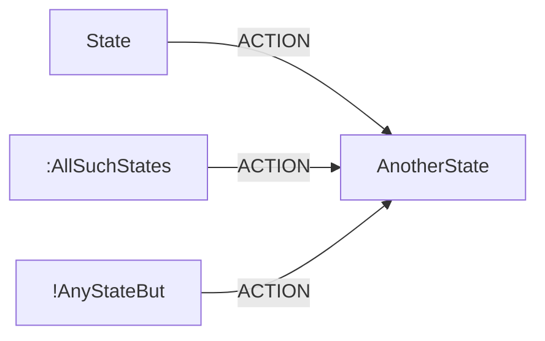
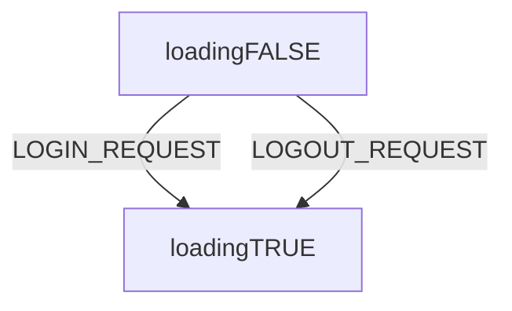
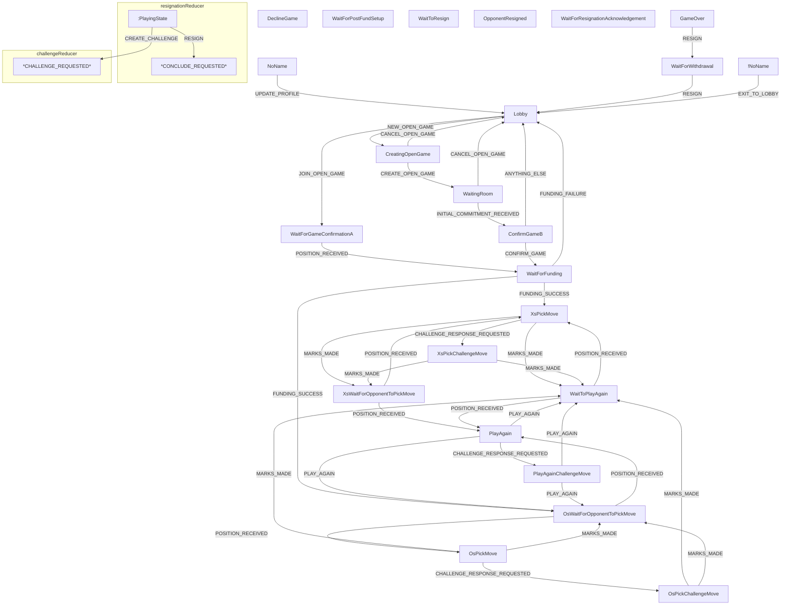

<!-- Recommend VSCode plugin 
Name: Markdown Preview Mermaid Support
Id: bierner.markdown-mermaid
Description: Adds Mermaid diagram and flowchart support to VS Code's builtin markdown preview
Version: 1.1.2
Publisher: Matt Bierner
VS Marketplace Link: https://marketplace.visualstudio.com/items?itemName=bierner.markdown-mermaid -->
<!-- also vscode-mermaid-syntax-highlight  -->
# Redux diagrams (current state)
as of commit 1947c682f74648ee162459314827bb9e24ca1fb1
### Methodology
In the TTT app, there are five independent parts of the `SiteState`, each reduced with its own reducer. Where these subreducers switch their behaviour on the name/type of a *state*, this can be nicely presented in a flowchart. Things are not so natural when there are a low number of state names (perhaps one) and reducers tend to switch entirely on the *actions* themselves (often updating fields independently of the current state).

Flowcharts are most useful when the flow is mostly a linear progression.

### Key: 

# Top level
## loginReducer
[`/packages/rps/src/redux/login/reducer.ts`](../src/redux/login/reducer.ts)

<!-- etc -- doesn't fit in a flowchart so nicely. -->
## gameReducer
[`/packages/rps/src/redux/game/reducer.ts`](../src/redux/game/reducer.ts)
This flowchart is made by constructing nodes from the *gamestate types*, otherwise known as *gamestate names*, from the relevant file in `/packages/rps/src/redux/game/state.ts` directory, and then constructing edges from the relationships defined in the game reducer `/packages/rps/src/redux/game/reducer.ts` directory. Edges are labelled with the *action types* from the `actions.ts` in the game subdirectory. The flowcharts suppress information about conditional checks that are performed by the reducers. Where useful, reducers have had their sub-reducers unpacked -- making for a fewer number of more complicated flowcharts. When a reducer returns the same state as the result of conditional checks failing, these loops are also suppressed. Globally handled actions are also sometimes suppressed.

At the start of each mermaid diagram, *all* relevant state names from the `/state.ts` file are included. This way we can easily track unused state names. 

