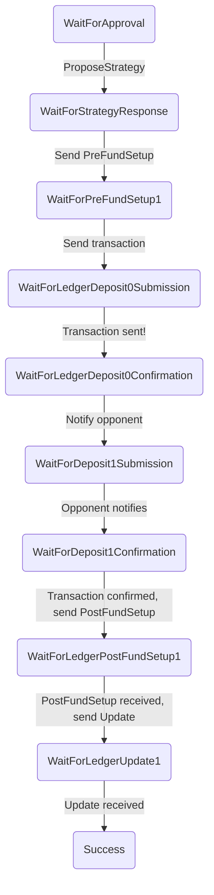
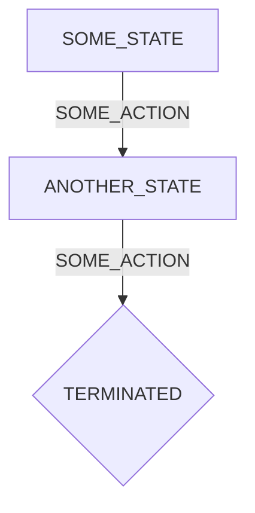
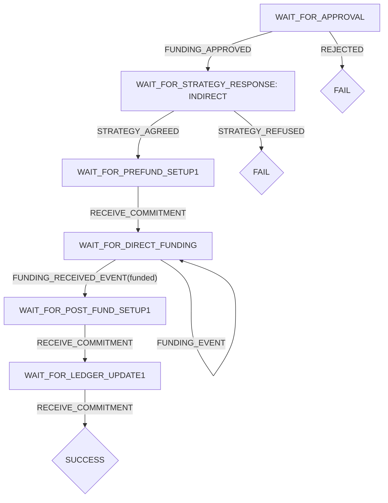
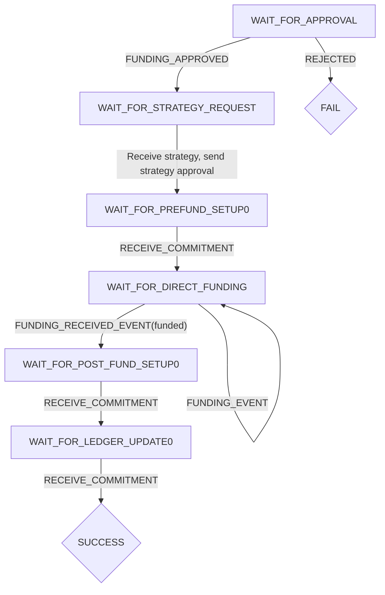
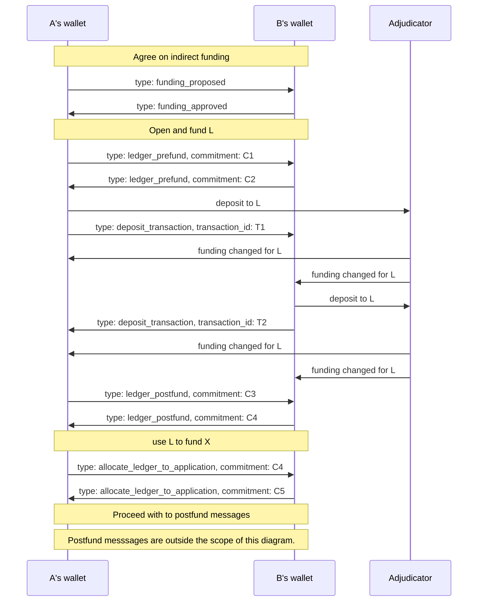

# Indirect Funding

The indirect funding module coordinates the process of funding an application channel via a ledger channel.

## How do actions get routed to the indirect funding module?

The wallet uses the `process` on the action to decide which module to route it to. For example, the following action will be processed by the indirect funding module:

```js
{
  type: 'ledger-updated',
  process: 'indirect-funding',
  channelId: 'abc123'
}
```

In order for this to work the following things must happen:

- Wallet messages sent to an opponent must include the `process` and `channelID` information, so that they can be correctly routed on receipt.
- Transactions sent to the `TransactionSender` must also include the `process` and `channelId`, so that the `TransactionSender` can include these properties on the `TransactionSubmitted` and `TransactionConfirmed` events.
- Any actions triggered from the UI during the indirect funding process must include the `process` property.

The `indirect-funding` module takes top priority for actions marked for it: these actions are always sent to the indirect funding reducer and they are not then sent anywhere else.

## What is the signature of the indirect-funding reducer?

For the time being, the indirect-funding reducer will accept an _initialized wallet state_ and return an _initialized wallet state_:

```ts
function indirectFundingReducer(state: Initialized, action: IndirectFundingAction): Initialized {
  // ...
}
```

The reducer acts on the entire state.

## How does the indirectFundingReducer handle actions?

The indirect funding process is not symmetric: the states you pass through depend if you are player A (the first player in the outcome at the time of funding) or player B. We model this by having a separate state machine for each player.

When handling actions, the `indirectFundingReducer` does the following:

1. Look up the current state of the funding process corresponding to the `channelId` in the action.
2. Determine from this state whether we are Player A or Player B.
3. Delegate to the reducer for player A or B as appropriate.

The player A and player B reducers encode the state transitions for their respective state machines. For example, player A's state machine is as follows:



### Example: receiving PostFundSetup1

1. The `MessageReceiver` receives a message:
   ```
   { process: 'indirect-funding', channelId: 'abc123', data: '0x123a32...' }
   ```
2. It triggers a `MessageReceived` action:
   ```
   { type: 'message-received', process: 'indirect-funding', channelId: 'abc123', commitment: '0x123a32...' }
   ```
3. This is routed to the `IndirectFundingReducer`, which looks to see if there's a current indirect funding for channel `abc123`. The player on the state is player A, so the request is delegated to the `PlayerAReducer`.
4. The `PlayerAReducer` sees that it is in the `WaitForLedgerPostFundSetup1` state.
5. It fetches the ledger channel data, `ledgerState`, from the channel store and calls the channel reducer:
   ```ts
   newLedgerState = channelReducer(ledgerState, action);
   ```
6. It sees whether `newLedgerState` is now in the `running` state (which will be the case if it received a valid PostFundSetup). If it is, it constructs the state change that will fund the application channel, `fundingCommitment`.
7. It then calls the `channelReducer` again with an `ownPositionReceived` action, which will cause it to check, store and sign the `fundingCommitment`.
8. It then sends this `fundingCommitment` to its opponent.

## What about re-using our existing direct funding code?

I think that, for the time being, we should just duplicate the direct funding code inside the indirect funding. It should be easy to factor this out later and it avoids having to decide upfront what the interface should be between these two different processes.

## State machines



Once the state machine reaches a terminated state, the process is dismantled.

### Player A



### Player B



## Indirect funding sequence diagram

### Overview

The sequence diagram shows the interaction between `player A`, `player B` and the adjudicator/blockchain. The diagram does not attempt to describe internal events for either of the players or the adjudicator.

### Starting state

We assume that the application is responsible for driving the application channel to the point where the channel is ready for funding.

### Terminology

Below, we refer to the application channel as `X`. We refer to the ledger channel funding the application channel as `L`. `Player A` is the first player, or, in other words, the player who initiated opening the application channel. A `proccess` is a coordinated sequence of actions that achieves a high-level channel goal like indirectly funding a channel, topping up of a channel, etc.

### Diagram

For the diagram below, every exchanged message between `player A` and `player B` also contains the following key-value pairs:

1.  `process: indirect_funding`
2.  `channelId: X`


