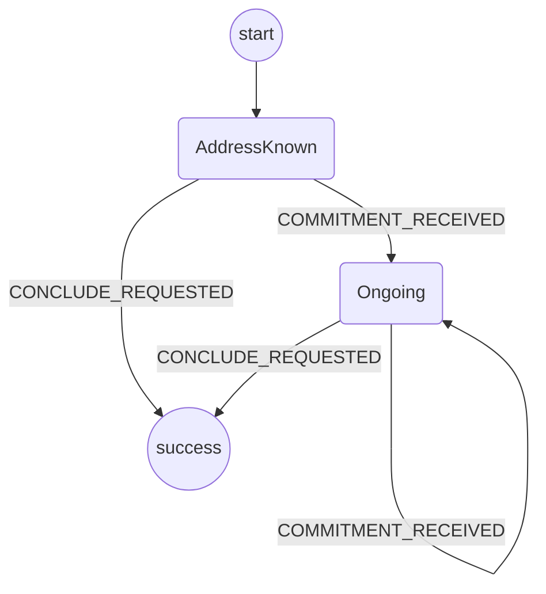

# Application Protocol

The purpose of this protocol is to manage the application's commitments.

It should be triggered by the `INITIALIZE_CHANNEL` event from the app.
This prepares an address to be used to sign application commitments.

It should never fail.

## State machine

The protocol is implemented with the following state machine.

Notes:

- `COMMITMENT_RECEIVED` is shorthand for either `OWN_COMMITMENT_RECEIVED` or `OPPONENT_COMMITMENT_RECEIVED`
- `CONCLUDE_REQUESTED` should get triggered when a conclude is requested. This means that the application protocol no longer needs to listen for commitments from the app.
- The application protocol is responsible for sending out signature and validation messages.
