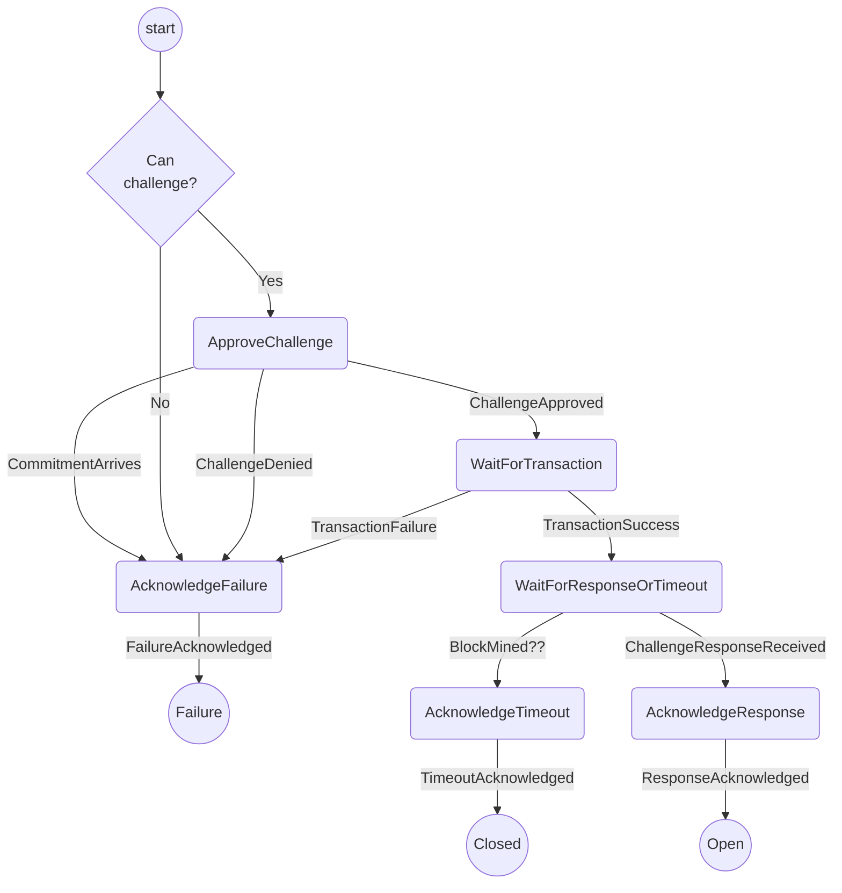

# Challenging Protocol

This protocol handles launching a challenge on the blockchain. It includes:

- Getting confirmation from the user to launch the challenge.
- Submitting the challenge transaction to the blockchain.
- Monitoring the blockchain for a response or timeout.

Out of scope (for now)

- Halting the challenge in the case where the opponent's commitment arrives between approval and transaction submission.
- Interrupting the "ApproveChallenge" screen if the opponent's commitment arrives during approval. (Instead, the user will be informed after they approve the challenge.)
- Chain reorgs (e.g. timeout on one fork vs. response on another)

## State machine

The protocol is implemented with the following state machine

Note:

- "Can challenge?" = "channel exists" && "has two commitments" && "not our turn"
- We don't currently give the option to retry in the case that the transaction fails.
- The `MyTurn` check is performed after approval, just in case the opponent's move has arrived in the meantime.

## Scenarios

To test all paths through the state machine we will use 5 different scenarios:

1. **Opponent responds**: `ApproveChallenge` -> `WaitForTransaction` -> `WaitForResponseOrTimeout`
   -> `AcknowledgeResponse` -> `Open`
2. **Challenge times out**: `WaitForResponseOrTimeout` -> `AcknowledgeTimeout` -> `Closed`
3. **Channel doesn't exist**: `AcknowledgeFailure` -> `Failure`
   - Challenge requested for `channelId` that doesn't exist in the wallet.
4. **Channel not fully open**: `AcknowledgeFailure` -> `Failure`
   - Challenge requested for channel which only has one state (two are needed to challenge).
5. **Already have latest commitment**: `AcknowledgeFailure` -> `Failure`
6. **User declines challenge**: `ApproveChallenge` -> `AcknowledgeFailure` -> `Failure`
7. **Receive commitment while approving**: `ApproveChallenge` -> `AcknowledgeFailure`
   - The opponent's commitment arrives while the user is approving the challenge
8. **Transaction fails**: `WaitForTransaction` -> `AcknowledgeFailure` -> `Failure`
