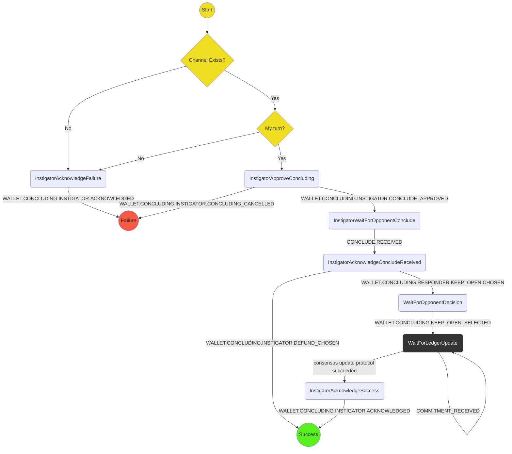

# Concluding Protocol (Instigator)

The purpose of this protocol is to instigate conclusion (or finalization) of a channel, i.e. to send a conclude commitment.
It covers:

- Checking to see if it is the player's turn and explaining they can't resign if not
- Asking user to confirm the resignation (probably displaying the current outcome)
- Formulating the conclude state and sending to the opponent
- Waiting for a conclude from the opponent
- Acknowledge channel concluded (giving the option to defund)

Out of scope (for the time being):

- Giving the option to launch a challenge if the conclude doesn't arrive

## State machine

The protocol is implemented with the following state machine

## Scenarios

We will use the following scenarios for testing:

1. **Happy path**: `InstigatorApproveConcluding` -> `InstigatorWaitForOpponentConclude` -> `InstigatorAcknowledgeChannelConcluded` -> `Success`
2. **Channel doesnt exist** `InstigatorAcknowledgeFailure` -> `Failure`
3. **Concluding not possible**: `InstigatorAcknowledgeFailure` -> `Failure`
4. **Concluding cancelled** `InstigatorApproveConcluding` -> `Failure` (note lack of acknowledgement screen)
