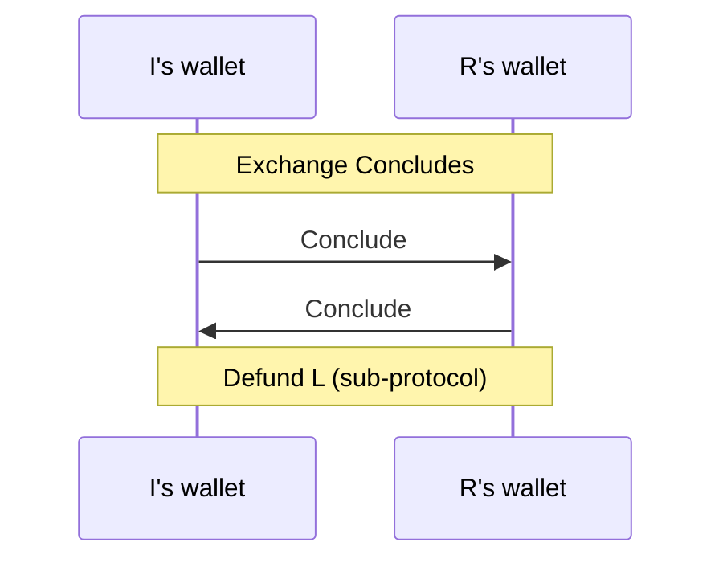

# Concluding

The concluding protocols coordinate the process of concluding a channel.

## The Protocol

The concluding protocol involves two parties: instigator and responder.
The instigator is identified by being a participant who has chosen to conclude the channel. The responder is a participant who has received a conclude commitment and responds in kind.

We therefore split the overall indirect-funding protocol into two sub-protocols: the
[instigator protocol](./instigator) and the [responder protocol](./responder).

The two protocols interact through the following messages:

