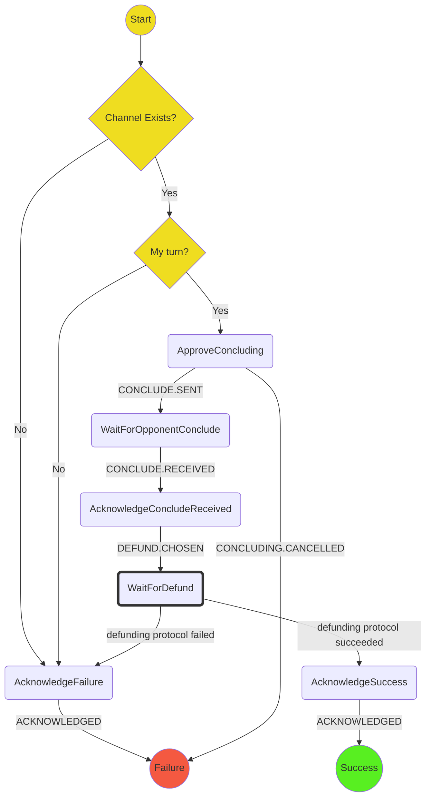
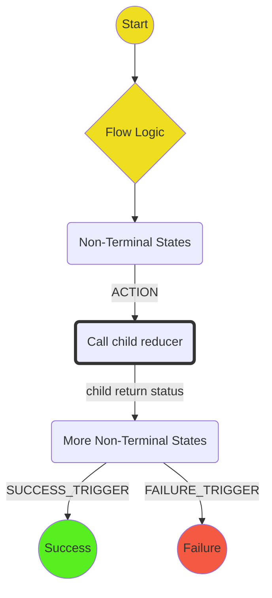

# Concluding Protocol

The purpose of this protocol is to resign a channel, i.e. to move to a conclude state.
It covers:

- Checking to see if it is the player's turn and explaining they can't resign if not
- Asking user to confirm the resignation (probably displaying the current outcome)
- Formulating the conclude state and sending to the opponent
- Waiting for a conclude from the opponent
- Acknowledge channel concluded (giving the option to defund)

Out of scope (for the time being):

- Giving the option to launch a challenge if the conclude doesn't arrive
- Allowing the user to not choose to not defund

## State machine

The protocol is implemented with the following state machine

Key:

## Scenarios

We will use the following scenarios for testing:

1. **Happy path**: `ApproveConcluding` -> `WaitForOpponentConclude` -> `AcknowledgeChannelConcluded` -> `WaitForDefund` -> `Success`
2. **Channel doesnt exist** `AcknowledgeFailure` -> `Failure`
3. **Concluding not possible**: `AcknowledgeFailure` -> `Failure`
4. **Concluding cancelled** `ApproveConcluding` -> `Failure`
5. **Defund failed** `WaitForDefund` -> `AcknowledgeFailure` -> `Failure`

# Terminology

Use "Conclude" / "Concluding" everywhere, here. In an application, you might choose to Resign, or you (or an opponent) might run out of funds. In these cases, according to the wallet you are concluding the channel.

For now we will avoid "Resigning", "Closing" and so on.

We will also include the `Defunding` protocol as an optional subprotocol of `Concluding`. If `Defunding` fails, `Concluding` will still be considered to have also failed.
