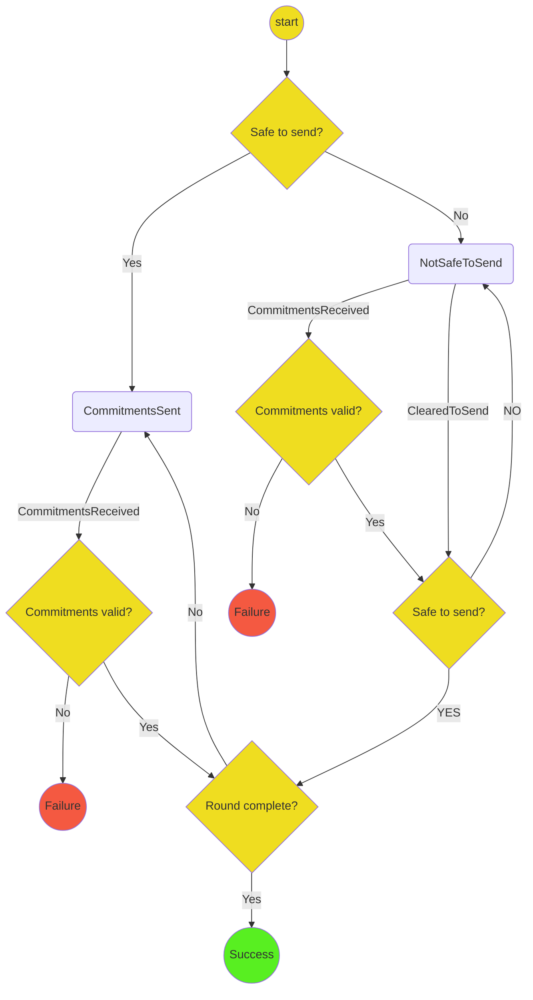

# Consensus Update Protocol

The purpose of the protocol is to handle updating the allocation and destination of channels running the consensus app to reach an outcome specified on initialization.

The protocol stores every new commitment it receives that represents a valid transition from the most recent commitment.
Commitments received in `COMMITMENTS_RECEIVED` are processed in order, and are ignored when they are an invalid transition.

When it is the participant's turn, and the protocol has been cleared to send,

- if the current proposal matches the desired outcome, the protocol votes in favour
- else, the protocol starts a new round proposing the desired outcome

In either case, the protocol moves to `CommitmentSent`.

The protocol returns failure precisely when it becomes the participant's turn when in the `CommitmentSent` state, and consensus has not been reached.
In this case, the protocol does not send a second commitment.
This prevents the possibility of an infinite loop.

The protocol returns success precisely when consensus is reached -- necessarily with the desired outcome, due to the above behaviour -- before the participant is required to send their second commitment.
Note that this could be the result of the protocol even if some of the subsequent commitments are invalid.

## State Machine

