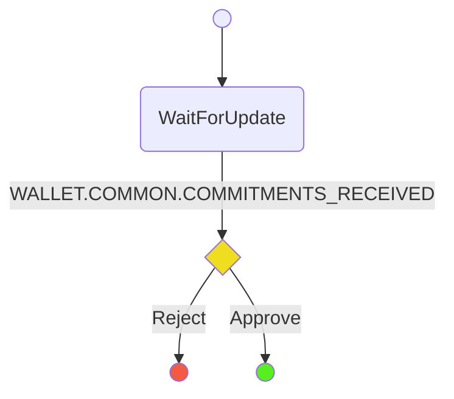

# Consensus Update Protocol

The purpose of the protocol is to handle updating the allocation and destination of channels running the consensus app.

## State Machine

## Scenarios

1. **Player A Happy Path** Start->WaitForUpdate->Success
2. **Player B Happy Path** Start->WaitForUpdate->Success
3. **Player A Commitment Rejected** WaitForUpdate->Failure
4. **Player B Commitment Rejected** WaitForUpdate->Failure
