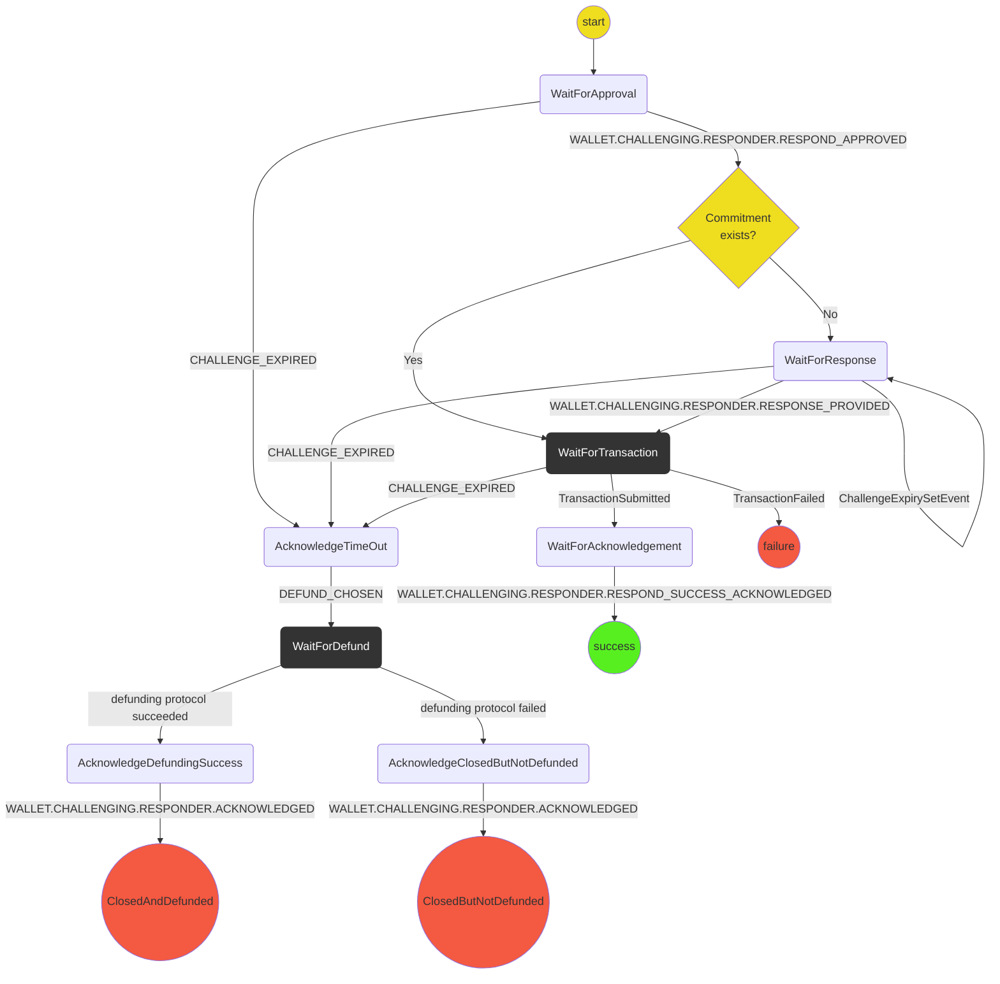

# Responding Protocol

The purpose of this protocol is handle responding to a challenge.
It covers:

- Deciding if we can respond to a challenge with commitments that the wallet already has.
- If the response needs a new commitment the response protocol accepting a response commitment.
- Getting confirmation from the user to launch a response.
- Submitting the response transaction to the blockchain.
- Getting acknowledgement from the user before returning to app.

Out of scope (for the time being):

- Handling where the response commitment comes from.
- The respond with alternative move option.

## State machine

Notes:

- On the `Approve` action we determine if we can refute/respond with an existing commitment.
  - If we can we craft and send the transaction. (Transition to `WaitForTransaction`)
  - If we can't we wait for a response to be provided to us.(Transition to `WaitForResponse`)
- Actions will be prefaced by Respond, (ie: `RespondApproved`)

## Test Scenarios

1. **Respond With Existing Commitment Happy Path:**
   - `WaitForApproval`
   - `WaitForTransaction`
   - `WaitForAcknowledgement`
   - `Success`
2. **Refute Happy Path:**
   - `WaitForApproval`
   - `WaitForTransaction`
   - `WaitForAcknowledgement`
   - `Success`
3. **Select Response Happy Path:**
   - `WaitForApproval`
   - `WaitForResponse`
   - `WaitForTransaction`
   - `WaitForAcknowledgement`
   - `Success`
4. **Transaction fails:**
   - `WaitForApproval`
   - `WaitForTransaction`
   - `Failure`
5. **Challenge expires and channel defunded:**
   - `WaitForResponse`
   - `AcknowledgeTimeout`
   - `WaitForDefund`
   - `AcknowledgeDefundingSuccess`
   - `ClosedAndDefunded`
6. **Challenge expires and channel NOT defunded:**
   - `WaitForDefund`
   - `AcknowledgeClosedButNotDefunded`
   - `ClosedButNotDefunded`
