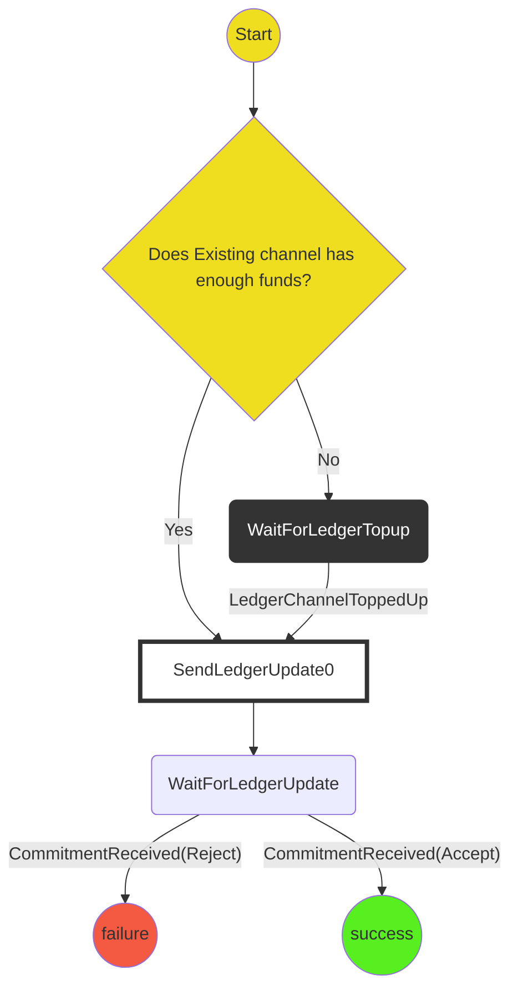
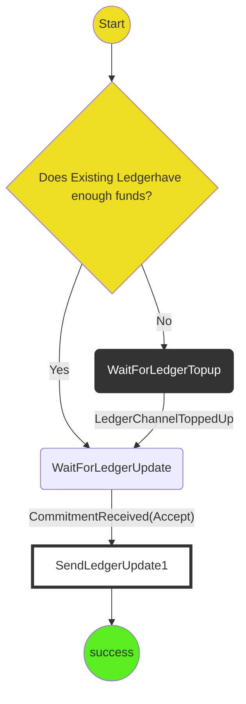

# Existing Ledger Funding Protocol

The purpose of this protocol is to fund a channel using an existing ledger channel. The protocol should

- Check if a ledger channel has enough funds to fund the requested channel.
  - If not it should initiate a ledger top-up protocol.
- Craft ledger updates to fund the channel. (Perhaps we should extract this into a protocol that can be shared by indirect-funding and Existing Ledgerfunding.)

Currently we assume a Ledger Top-up protocol handles both the cases where a current player needs to top-up funds and the case where their opponent needs to top-up.

# State Machine

### Player A State Machine

### Player B State Machine

### Scenarios:

1. **Player A has funds Happy Path** Start->WaitForLedgerUpdate->Success
2. **Player B has funds Happy Path** Start->WaitForLedgerUpdate->Success
3. **Player A receives invalid update commitment** WaitForLedgerUpdate->Failure
4. **Player B receives invalid update commitment** WaitForLedgerUpdate->Failure
   These scenarios depend on Ledger Top-Up:
5. **Player A requires top-up** Start->WaitForLedgerTopUp->WaitForLedgerUpdate->Success
6. **Player requires top-up** Start->WaitForLedgerTopUp->WaitForLedgerUpdate->Success
