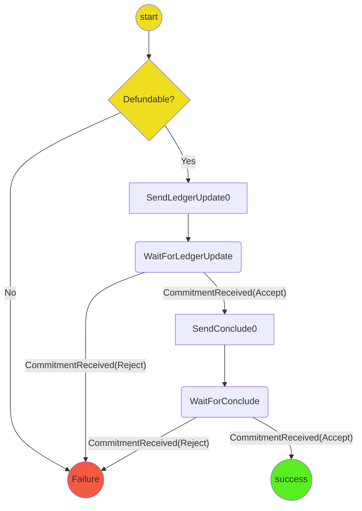
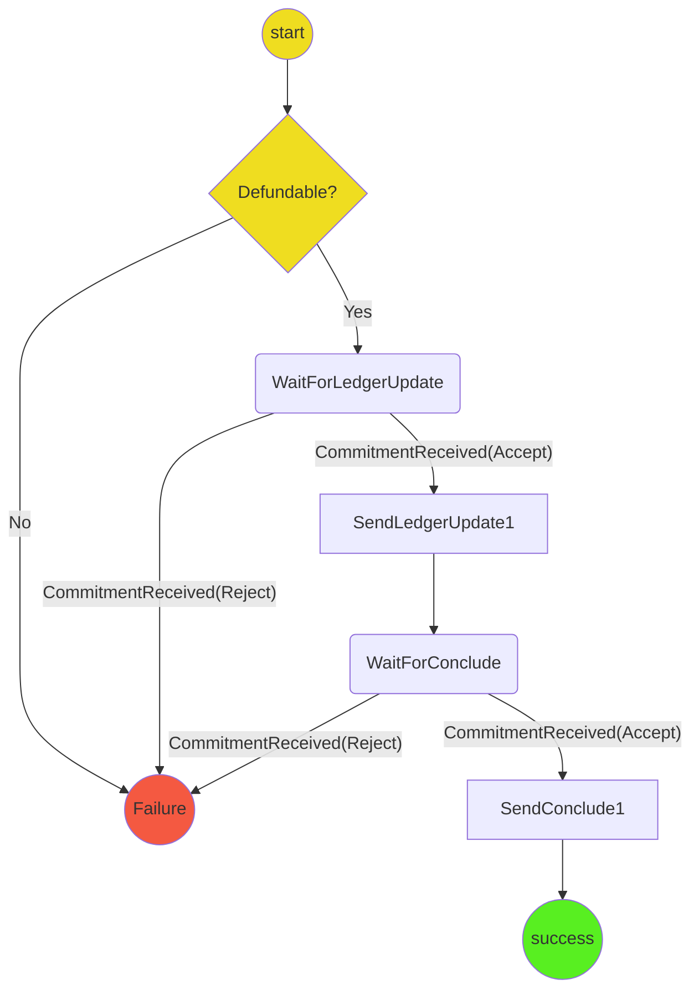

# Indirect De-Funding Protocol

The purpose of this protocol is handle de-funding a channel that has been indirectly funded.

The protocol exchanges updates to allocate funds back to the player and conclude commitments to close the channel.

It covers:

- Checking that a channel is closed (either finalized on chain or a conclusion proof exists)
- Crafting a ledger update that allocates the funds to the players.
- Waiting for a ledger response from the opponent.
- Crafting a conclude commitment to close the ledger channel.

## State machine

### Player A State machine

### Player B State machine

Notes:

- SendLedgerUpdate is not a state but indicate when the ledger update is sent.
- A single reducer implements both the player A and B state machine.

## Scenarios

1. **Happy Path - Player A** Start->SendLedgerUpdate->WaitForLedgerUpdate->Success
2. **Happy Path - Player B** Start->WaitForLedgerUpdate->SendLedgerUpdate->Success
3. **Not De-fundable** Start->Failure
4. **Commitment Rejected - Player A** Start->SendLedgerUpdate->WaitForLedgerUpdate->Failure
5. **Commitment Rejected - Player B** Start->WaitForLedgerUpdate->Failure
