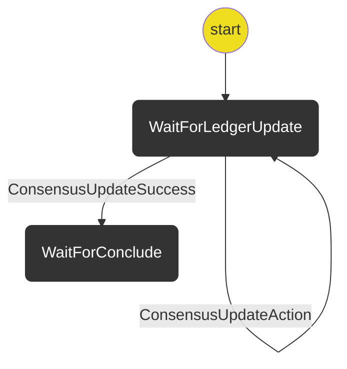

# Indirect De-Funding Protocol

The purpose of this protocol is handle de-funding a channel that has been indirectly funded.

The protocol exchanges updates to allocate funds back to the player.

The protocol assumes the application channel is closed and a new ledger consensus does need to be reached.

It covers updating consensus (using ConsensusUpdate sub-protocol) on the ledger channel to reflect the app channel balance.

## State machine

