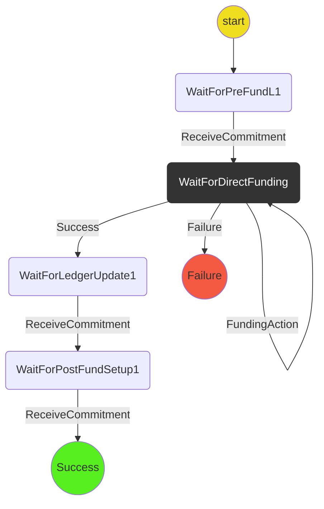

# New Ledger Funding Protocol for Player A

### State Machine

### Scenarios

We will use the following two scenarios in tests:

1. **Happy path**: `WaitForPreFundL1` -> `WaitForDirectFunding` -> `WaitForLedgerUpdate1` -> `WaitForPostFund1` -> `Success`
2. **Ledger funding fails**: `WaitForDirectFunding` -> `Failure`
